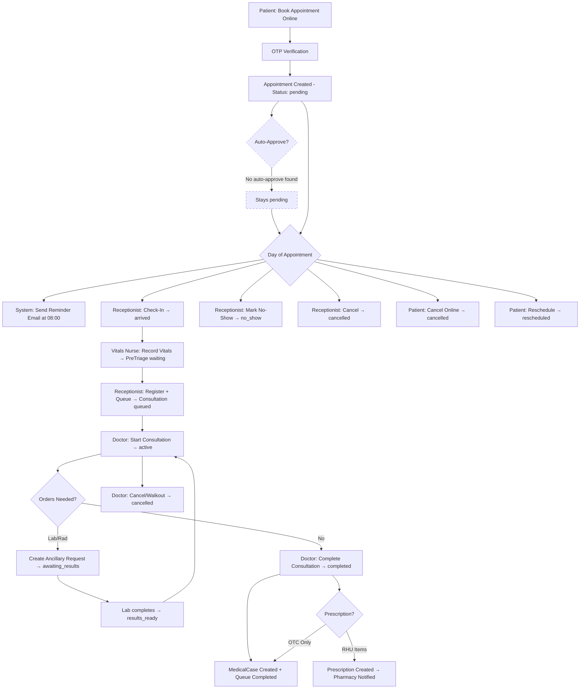
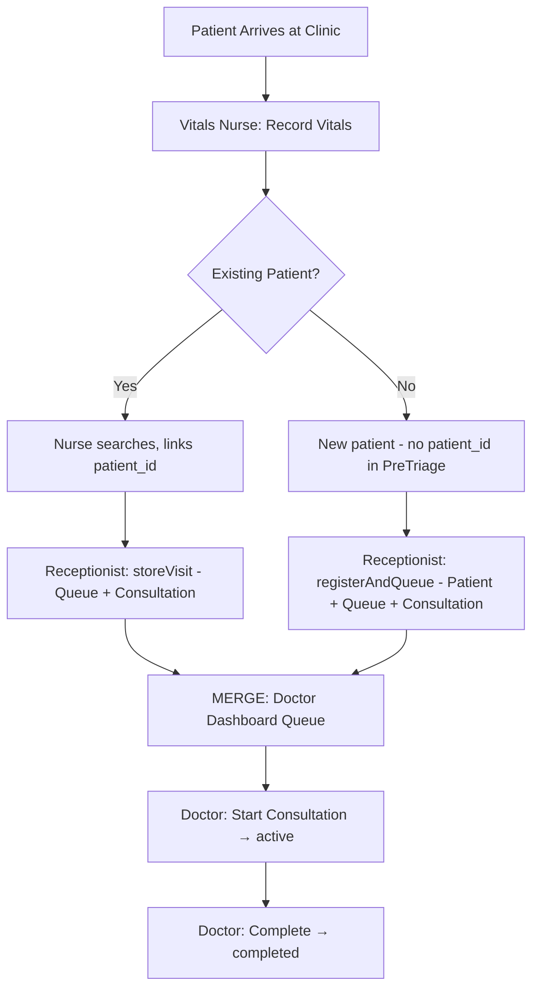
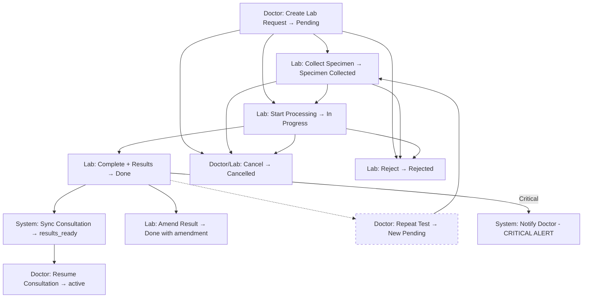
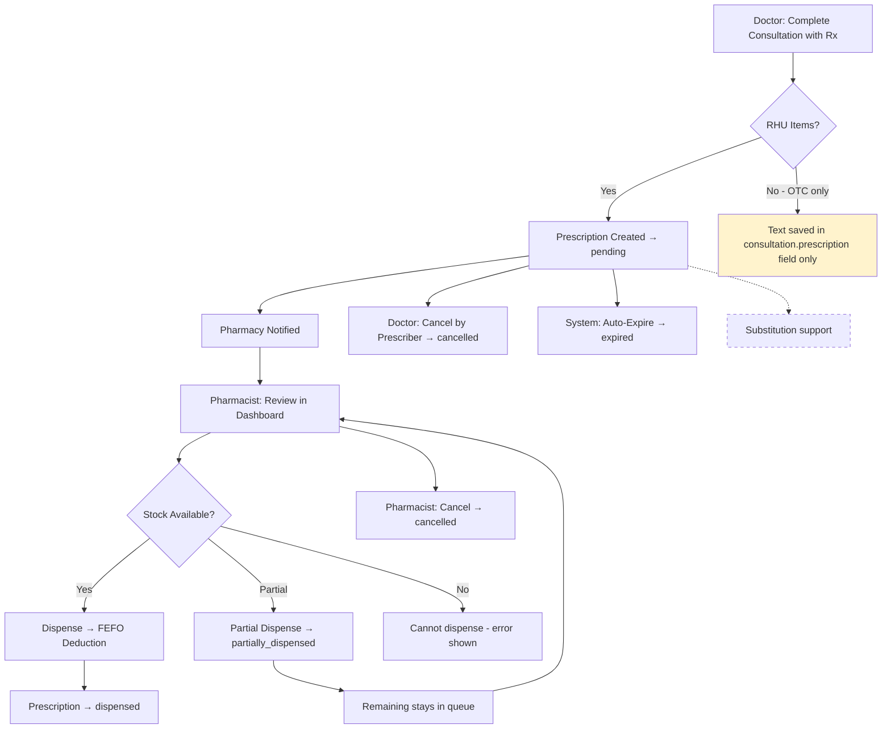
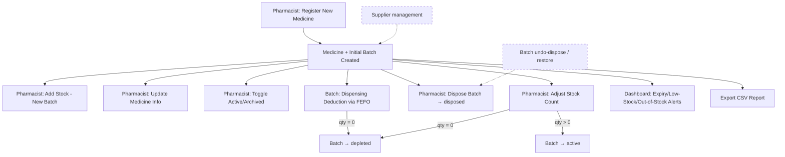

# Phase 1: End-to-End Process Flows

---

## Flow A: Appointment to Consultation Closing

### A.1 Numbered Walkthrough

| Step | Actor | Screen/Page | Endpoint/Function | DB Records | Status Before → After | Validation | Trigger for Next Step | Completeness |
|------|-------|------------|-------------------|------------|----------------------|------------|----------------------|-------------|
| 1 | Patient | `/appointment` (public) | `PublicController::createAppointment` | — | — | — | Page load | Complete |
| 2 | Patient | Appointment form | `PublicController::checkAvailability` | — | — | Date validation, slot availability | AJAX check | Complete |
| 3 | Patient | Appointment form | `PublicController::getTimeSlots` | — | — | — | Time slot selection | Complete |
| 4 | Patient | Appointment form | `PublicController::checkDuplicate` | — | — | Duplicate check (name+dob+date) | AJAX pre-submit | Complete |
| 5 | Patient | Appointment form | `PublicController::sendOtp` | — | — | Email required, rate limit (3/hr) | OTP email sent | Complete |
| 6 | Patient | OTP verification | `PublicController::verifyOtp` | — | — | OTP match, expiry, max attempts with backoff | OTP verified | Complete |
| 7 | Patient | Appointment form submit | `PublicController::storeAppointment` | Appointment created | — → `pending` | Full validation, throttle:booking (50/day/IP), data privacy agreed | Appointment created + confirmation email | Complete |
| 8 | Patient | `/appointment/manage` | `PublicController::manageAppointment` | — | — | Reference # + email auth (session) | Login to management | Complete |
| 9 | Patient | `/appointment/dashboard` | `PublicController::dashboardAppointment` | — | — | Session-based auth | View status | Complete |
| 10 | Patient | Dashboard | `PublicController::cancelAppointment` | Appointment updated | `pending`/`approved`/`rescheduled` → `cancelled` | Status check | Cancellation email sent | Complete |
| 11 | Patient | Dashboard | `PublicController::rescheduleAppointment` | Appointment updated | `pending`/`approved`/`rescheduled` → `rescheduled` | New date validation | Reschedule email sent | Complete |
| 12 | System | — | `SendAppointmentReminders` command | — | — | Day-before check | Email reminder at 08:00 | Complete |
| 13 | Receptionist | Front desk dashboard | `RegistrationController::checkIn` | Appointment updated | `pending`/`approved`/`rescheduled` → `arrived` | Date check (no early check-in) | Patient proceeds to triage | Complete |
| 14 | Receptionist | Front desk dashboard | `RegistrationController::markNoShow` | Appointment updated | `approved`/`rescheduled`/`pending` → `no_show` | Status check | Record updated | Complete |
| 15 | Receptionist | Front desk dashboard | `RegistrationController::cancelAppointment` | Appointment updated | `pending`/`approved`/`rescheduled` → `cancelled` | Reason required (nullable) | Cancellation email sent | Complete |
| 16 | Vitals Nurse | Triage dashboard | `TriageController::store` | PreTriage created | — → `waiting` | Vitals validation (BP, temp, etc.), duplicate check | Appointment → `triaged` | Complete |
| 17 | Receptionist | Registration index | `RegistrationController::storeVisit` | Consultation + Queue created | PreTriage `waiting` → `claimed`; Appointment → `registered` | Pre-triage required, severity, duplicate queue check | Patient queued | Complete |
| 18 | Doctor | Doctor dashboard | `DoctorController::startConsultation` | Consultation updated | `queued` → `active` | Ownership check, Queue → `Calling` | Doctor opens consultation | Complete |
| 19 | Doctor | Consultation page | `DoctorController::storeAncillaryRequest` | AncillaryRequest created | Consultation `active` → `awaiting_results` | Valid test from catalog, no duplicate active test | Lab/Rad request sent | Complete |
| 20 | Doctor | Consultation page | `DoctorController::completeConsultation` | Consultation + MedicalCase + Prescription | `active` → `completed`; Appointment → `done`; PreTriage → `completed`; Queue → `Completed` | Diagnosis required | Pharmacy notified if RHU Rx | Complete |
| 21 | Doctor | Consultation page | `DoctorController::cancelConsultation` | Consultation + linked records | `active`/`queued` → `cancelled` | Reason required, cascading cancel | All linked records cancelled | Complete |
| 22 | Doctor | Completed consultation | `DoctorController::storeAddendum` | Consultation notes appended | `completed`/`done` (unchanged) | Only attending clinician, max 2000 chars | Audit logged | Complete |

### A.2 Mermaid Flow Diagram

### A.3 Status Lifecycle Tables

#### Appointment Statuses

| Status | Set By | Transitions To | Trigger | Evidence |
|--------|--------|---------------|---------|----------|
| `pending` | System | `approved`¹, `rescheduled`, `cancelled`, `arrived`, `no_show` | Booking submitted | PublicController::storeAppointment L29 |
| `approved` | System¹ | `arrived`, `cancelled`, `rescheduled`, `no_show`, `triaged` | ¹No explicit approve endpoint found | — |
| `rescheduled` | Patient/Staff | `arrived`, `cancelled`, `no_show` | Patient reschedules | PublicController::rescheduleAppointment |
| `arrived` | Receptionist | `triaged`, `registered`, `cancelled` | Check-in at desk | RegistrationController::checkIn L128 |
| `triaged` | Vitals Nurse | `registered` | Vitals recorded | TriageController::store L285 |
| `registered` | Receptionist | `done`, `cancelled` | Patient queued | RegistrationController::storeVisit L764 |
| `done` | Doctor | — (terminal) | Consultation completed | DoctorController::completeConsultation L305 |
| `cancelled` | Multiple | — (terminal) | Cancellation | Multiple controllers |
| `no_show` | Receptionist/System | — (terminal) | Patient didn't arrive | RegistrationController::markNoShow L177 |

> ¹ **Finding**: No explicit "approve" endpoint exists. The `approved` status is in the enum but there is no controller action that transitions `pending` → `approved`. The `FixStuckAppointments` command and front-desk views reference it, suggesting it may have been intended but the auto-approve or manual approve step is **missing**.

#### Consultation Statuses

| Status | Set By | Transitions To | Evidence |
|--------|--------|---------------|----------|
| `queued` | Receptionist | `active` | RegistrationController::storeVisit L737 |
| `active` | Doctor/Nurse | `completed`, `awaiting_results`, `cancelled` | DoctorController::startConsultation L176 |
| `awaiting_results` | Doctor/System | `results_ready`, `active` | DoctorController::storeAncillaryRequest L511 |
| `results_ready` | Lab system | `active` | LabController::syncConsultationReadiness L459 |
| `completed` | Doctor/Nurse | `done`² | DoctorController::completeConsultation L284 |
| `done` | —² | — (terminal) | Referenced in queries but no transition code found |
| `cancelled` | Doctor/Nurse | — (terminal) | DoctorController::cancelConsultation L679 |

> ² **Finding**: `done` is used in `whereIn` clauses alongside `completed` but no code transitions a consultation from `completed` to `done`. These appear to be treated as equivalent terminal states. **Dead status concern**: `done` may be a legacy status with no active setter.

### A.4 End State

The defined end states for Flow A are:
- **Appointment**: `done` (success), `cancelled`, or `no_show`
- **Consultation**: `completed` (success) or `cancelled`
- **PreTriage**: `completed` or `cancelled`
- **Queue**: `Completed` or `Cancelled`

---

## Flow B: Walk-in to Consultation Closing

### B.1 Numbered Walkthrough

| Step | Actor | Screen/Page | Endpoint/Function | DB Records | Status Before → After | Completeness |
|------|-------|------------|-------------------|------------|----------------------|-------------|
| 1 | Patient | Arrives at clinic | — | — | — | N/A |
| 2 | Vitals Nurse | Triage dashboard | `TriageController::store` | PreTriage created | — → `waiting` | Complete |
| 3 | Vitals Nurse | Search patient | `TriageController::searchPatient` | — | — | Complete |
| 4a | Receptionist (existing patient) | Registration index | `RegistrationController::storeVisit` | Consultation + Queue | PreTriage → `claimed` | Complete |
| 4b | Receptionist (new patient) | Registration form | `RegistrationController::registerAndQueue` | Patient + Consultation + Queue | PreTriage → `claimed` | Complete |
| 5+ | Same as Flow A steps 18-22 | — | — | — | — | Complete |

### B.2 Differences from Flow A

| Aspect | Appointment (Flow A) | Walk-in (Flow B) |
|--------|---------------------|------------------|
| Entry point | Online booking, check-in at desk | Direct arrival at vitals station |
| Patient identification | Pre-filled from appointment data | Manual search or new registration |
| Queue number prefix | `APED-` (pedia appointment) | `PED-` / `REG-` / `PRI-` |
| Priority | Appointment priority in pedia interleaving | Classification-based (Senior/PWD get 2:1 ratio) |
| Merge point | Step 16 (Triage) — both flows converge at vitals recording | — |
| Pedia walk-in cap | N/A | 5 walk-in slots/day (configurable), emergency override available |

### B.3 Mermaid Diagram

---

## Flow C: Laboratory Request Branch

### C.1 Numbered Walkthrough

| Step | Actor | Endpoint/Function | DB Records | Status Before → After | Completeness |
|------|-------|-------------------|------------|----------------------|-------------|
| 1 | Doctor | `DoctorController::storeAncillaryRequest` | AncillaryRequest created | — → `Pending`; Consultation → `awaiting_results` | Complete |
| 2 | Lab Staff | `LabController::collectSpecimen` | AncillaryRequest updated | `Pending` → `Specimen Collected` | Complete |
| 3 | Lab Staff | `LabController::startProcessing` | AncillaryRequest updated | `Pending`/`Specimen Collected` → `In Progress` | Complete |
| 4 | Lab Staff | `LabController::completeRequest` | AncillaryRequest updated | `In Progress` → `Done` | Complete |
| 5 | Lab Staff | — | Consultation synced | Consultation → `results_ready` (if all tests done) | Complete |
| 6 | Doctor | `DoctorController::startConsultation` (resume) | Consultation updated | `results_ready` → `active` | Complete |
| 7 | Lab Staff | `LabController::amendResult` | AncillaryRequest updated (previous data preserved) | `Done` → `Done` (is_amended=true) | Complete |
| 8 | Doctor | `DoctorController::repeatAncillaryRequest` | New AncillaryRequest (parent_id linked) | — → `Pending` (repeat); Consultation → `awaiting_results` | Complete |
| 9 | Lab Staff | `LabController::rejectRequest` | AncillaryRequest updated | `Pending`/`Specimen Collected`/`In Progress` → `Rejected` | Complete |
| 10 | Doctor | `DoctorController::cancelAncillaryRequest` | AncillaryRequest updated | Not `Done` → `Cancelled` | Complete |
| 11 | Lab Staff | `LabController::cancelRequest` | AncillaryRequest updated | Not `Done` → `Cancelled` | Complete |
| 12 | Lab Staff | `LabController::archiveRequest` | AncillaryRequest (archived_at set) | Any → archived (status unchanged) | Complete |
| 13 | Lab Staff | `LabController::restoreRequest` | AncillaryRequest (archived_at cleared) | Archived → `Pending` | Complete |

### C.2 Critical Value Alert Path

When a lab result contains panic/critical values:
1. Lab tech marks `is_critical` and provides `critical_remarks`
2. System flags `_is_critical` in `result_data` JSON
3. `CriticalLabResultNotification` sent to attending doctor/nurse
4. Audit log records "CRITICAL Diagnostic Results Completed"

Evidence: `LabController::completeRequest` L187-234

### C.3 Ancillary Request Status Lifecycle

| Status | Set By | Transitions To | Evidence |
|--------|--------|---------------|----------|
| `Pending` | Doctor | `Specimen Collected`, `In Progress`, `Cancelled`, `Rejected` | DoctorController L507 |
| `Specimen Collected` | Lab Staff | `In Progress`, `Cancelled`, `Rejected` | LabController L124-128 |
| `In Progress` | Lab Staff | `Done`, `Cancelled`, `Rejected` | LabController L156-159 |
| `Done` | Lab Staff | — (terminal, but amendable) | LabController L201-206 |
| `Cancelled` | Doctor/Lab | — (terminal) | Multiple |
| `Rejected` | Lab Staff | — (terminal) | LabController L329-334 |

### C.4 Mermaid Diagram

---

## Flow D: Pharmacy/Prescription Branch

### D.1 Numbered Walkthrough

| Step | Actor | Endpoint/Function | DB Records | Status Before → After | Completeness |
|------|-------|-------------------|------------|----------------------|-------------|
| 1 | Doctor/Nurse | `completeConsultation` → `InteractsWithPrescriptions::recordPrescription` | Prescription + PrescriptionItems | — → `pending` | Complete |
| 2 | System | `InteractsWithPrescriptions::notifyPharmacy` | Notification sent | — | Complete |
| 3 | Pharmacist | `PharmacyController::dashboard` | — (read) | — | Complete |
| 4 | Pharmacist | `PharmacyController::dispense` | Prescription, PrescriptionItems, MedicineBatches, InventoryLogs | `pending` → `dispensed` or `partially_dispensed` | Complete |
| 5 | Pharmacist | `PharmacyController::cancel` | Prescription updated | `pending`/`partially_dispensed` → `cancelled` | Complete |
| 6 | Doctor | `DoctorController::cancelByPrescriber` | Prescription updated | `pending`/`partially_dispensed` → `cancelled` | Complete |
| 7 | System | `ExpireStalePrescriptions` command | Prescription updated | `pending` → `expired` | Complete |

### D.2 Dispensing Logic (FEFO)

1. Stock pre-flight check: ensures sufficient unexpired stock per item
2. Transaction with row-level locks (`lockForUpdate()`)
3. Batches ordered by `expiration_date ASC` (First-Expiry-First-Out)
4. Each batch decremented, marked `depleted` if qty reaches 0
5. `InventoryLog` created per batch deduction
6. Cumulative `dispensed_quantity` tracked on `PrescriptionItem`
7. Prescription status: `dispensed` if all items fully dispensed, else `partially_dispensed`

Evidence: `PharmacyController::dispense` L268-376

### D.3 Prescription Status Lifecycle

| Status | Set By | Transitions To | Evidence |
|--------|--------|---------------|----------|
| `pending` | Doctor/Nurse | `dispensed`, `partially_dispensed`, `cancelled`, `expired` | InteractsWithPrescriptions L122 |
| `partially_dispensed` | Pharmacist | `dispensed`, `cancelled` | PharmacyController L356 |
| `dispensed` | Pharmacist | — (terminal) | PharmacyController L356 |
| `cancelled` | Pharmacist/Doctor | — (terminal) | PharmacyController L1193, DoctorController L636 |
| `expired` | System | — (terminal) | ExpireStalePrescriptions command |

### D.4 Mermaid Diagram

> **Finding**: No substitution mechanism exists. If a prescribed medicine is out of stock, the pharmacist must ask the doctor to cancel and re-prescribe. There is no in-system substitution workflow.

---

## Flow E: Inventory and Supply Management

### E.1 Numbered Walkthrough

| Step | Actor | Endpoint/Function | DB Records | Completeness |
|------|-------|-------------------|------------|-------------|
| 1 | Pharmacist | `PharmacyController::storeMedicine` | Medicine + MedicineBatch + InventoryLog | Complete |
| 2 | Pharmacist | `PharmacyController::updateMedicine` | Medicine updated (name, generic, form, category, unit) | Complete |
| 3 | Pharmacist | `PharmacyController::addStock` | MedicineBatch + InventoryLog | Complete |
| 4 | Pharmacist | `PharmacyController::toggleMedicineStatus` | Medicine `is_active` toggled | Complete |
| 5 | Pharmacist | `PharmacyController::disposeBatch` | MedicineBatch → `disposed`, qty → 0, InventoryLog | Complete |
| 6 | Pharmacist | `PharmacyController::adjustStock` | MedicineBatch qty adjusted, InventoryLog | Complete |
| 7 | System | Dashboard banners | Expired, expiring-soon, low-stock, out-of-stock counts | Complete |
| 8 | Pharmacist | `PharmacyController::medicines` | Filterable list with search, form filter, status filter | Complete |
| 9 | Pharmacist | `PharmacyController::exportStockCsv` | CSV export | Complete |
| 10 | Pharmacist | `PharmacyController::writtenOff` | Disposed batch history with search, date range, reason filter | Complete |

### E.2 Medicine Batch Status Lifecycle

| Status | Set By | Transitions To | Evidence |
|--------|--------|---------------|----------|
| `active` (default) | System | `depleted`, `disposed` | MedicineBatch default |
| `depleted` | System | `active` (via adjust) | PharmacyController L319 (dispensing), L1020 (adjust) |
| `disposed` | Pharmacist | — (terminal) | PharmacyController L943-944 |

### E.3 Disposal Reasons (Validated)

- Expired
- Damaged / Broken
- Contaminated
- Supplier Recall
- Other (requires notes)

Evidence: `PharmacyController::disposeBatch` L917

### E.4 Stock Adjustment Reasons (Validated)

- Physical Recount
- Damage / Breakage
- Audit Correction
- Received Adjustment
- Other (requires notes)

Evidence: `PharmacyController::adjustStock` L987

### E.5 Mermaid Diagram

> **Findings**:
> - No supplier management entity exists (Missing)
> - Disposed batches cannot be restored/un-disposed (Missing)
> - No low-stock threshold configuration per medicine — hard-coded at 20 units (Loophole)

---

## Flow F: Other Branches

### F.1 Follow-up Visit Tracking

| Step | Actor | Endpoint | Status | Completeness |
|------|-------|---------|--------|-------------|
| 1 | Doctor | `completeConsultation` (is_followup_needed=true) | Consultation gets `followup_date`, `followup_doctor_id` | Complete |
| 2 | System | Patient model updated | `next_followup_date`, `previous_doctor_id` | Complete |
| 3 | Receptionist | `FollowUpController::index` | View overdue/due/upcoming follow-ups | Complete |
| 4 | Receptionist | `FollowUpController::reschedule` | Update follow-up date | Complete |
| 5 | Receptionist | `FollowUpController::fulfill` | Mark follow-up completed | Complete |
| 6 | System | On next visit, auto-detect follow-up routing | Routes to original doctor if present | Complete |
| 7 | Patient | Public appointment form | Can flag `is_follow_up` + verify with reference # | Complete |

### F.2 Clinical Nurse Consultation Path

Clinical nurses handle light-severity cases independently:

| Step | Actor | Endpoint | Completeness |
|------|-------|---------|-------------|
| 1 | Nurse | `NurseController::startConsultation` | Complete |
| 2 | Nurse | `NurseController::completeConsultation` | Complete |
| 3 | Nurse | `NurseController::forwardToDoctor` | Complete |
| 4 | Nurse | `NurseController::storeAncillaryRequest` | Complete |
| 5 | Nurse | `NurseController::cancelConsultation` | Complete |
| 6 | Nurse | `NurseController::storeAddendum` | Complete |
| 7 | Nurse | `NurseController::cancelByPrescriber` | Complete |

> Nurse has nearly identical capabilities to Doctor for consultations they own.

### F.3 Referral System

**Status: NOT IMPLEMENTED**

No referral model, controller, or routes exist. The doctor's cancel-consultation form mentions "Referred" as a reason string, but there is no structured referral record, destination facility tracking, referral letter generation, or receiving-facility workflow.

### F.4 Inter-Staff Chat

| Feature | Endpoint | Completeness |
|---------|---------|-------------|
| List conversations | `ChatController::index` | Complete |
| Create conversation | `ChatController::store` | Complete |
| View messages | `ChatController::messages` | Complete |
| Send message | `ChatController::sendMessage` | Complete |
| Mark as read | `ChatController::markAsRead` | Complete |
| List staff users | `ChatController::users` | Complete |
| Unread count | `ChatController::unreadCount` | Complete |

### F.5 Patient Records & Retention

| Feature | Evidence | Completeness |
|---------|---------|-------------|
| Patient master list (Frontdesk) | `PatientController::index` | Complete |
| Patient detail view | `PatientController::show` | Complete |
| Patient records (Admin) | `AdminController::patientRecordsIndex` | Complete |
| Patient detail (Admin) | `AdminController::showPatient` | Complete |
| ITR Print | `AdminController::printItr` | Complete |
| Ancillary Print | `AdminController::printAncillary` | Complete |
| Retention management | `AdminController::retentionIndex`, `extendRetention`, `deleteRetention` | Complete |
| Auto-expiry (10 years) | Patient model `expires_at`, `Prunable` trait | Complete |
| Soft delete | Patient `SoftDeletes` trait | Complete |
| Archive restore | `ArchiveController::restore` | Complete |
