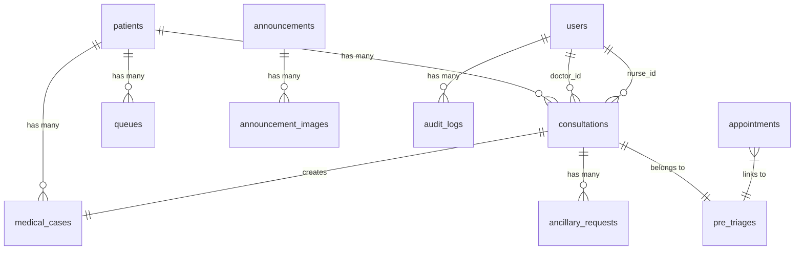

# Detailed System Documentation: Silang RHU Management Information System

> **Document Version:** 1.0  
> **System Version:** Laravel 12  
> **Date Generated:** April 27, 2026  
> **Authors:** Conchas, Isuga, Ripas, Takeuchi  

---

## Table of Contents

1. [System Overview](#1-system-overview)
2. [Technology Stack](#2-technology-stack)
3. [Authentication & Security Module](#3-authentication--security-module)
4. [Role-Based Access Control (RBAC)](#4-role-based-access-control-rbac)
5. [Public-Facing Portal Module](#5-public-facing-portal-module)
6. [Appointment Scheduling Module](#6-appointment-scheduling-module)
7. [Vitals Nurse / Pre-Triage Module](#7-vitals-nurse--pre-triage-module)
8. [Front Desk & Registration Module](#8-front-desk--registration-module)
9. [Intelligent Queueing Engine](#9-intelligent-queueing-engine)
10. [Doctor / Clinical Consultation Module](#10-doctor--clinical-consultation-module)
11. [Clinical Nurse Module](#11-clinical-nurse-module)
12. [Ancillary Services Module (Laboratory & Radiology)](#12-ancillary-services-module-laboratory--radiology)
13. [Content Management System (CMS)](#13-content-management-system-cms)
14. [Administration & Analytics Module](#14-administration--analytics-module)
15. [Archive & Data Retention Module](#15-archive--data-retention-module)
16. [Audit Logging System](#16-audit-logging-system)
17. [Database Schema Reference](#17-database-schema-reference)
18. [Data Privacy & Compliance](#18-data-privacy--compliance)
19. [Future State of the System (Roadmap)](#19-future-state-of-the-system-roadmap)

---

## 1. System Overview

The Silang RHU Management Information System (MIS) is a web-based, cloud-hosted application developed to digitize and streamline the end-to-end patient care workflow of the Rural Health Unit of Silang, Cavite. The system replaces paper-based processes including manual logbook registration, manila folder retrieval, handwritten prescriptions, and verbal queue management with a fully integrated digital platform.

The system serves **seven distinct user roles** and manages the complete patient lifecycle from online appointment booking through consultation, ancillary services (laboratory/radiology), to pharmacy fulfillment and medical certificate generation.

**Key Problem Solved:** The existing manual workflow results in an average patient wait time of **2.5 hours**, with staff spending up to **15 minutes** physically searching for patient folders. The MIS eliminates these bottlenecks through automated duplicate detection, intelligent practitioner-specific queueing, and centralized electronic health records.

---

## 2. Technology Stack

### 2.1 Backend Framework
- **Language:** PHP 8.2+
- **Framework:** Laravel 12.0 (MVC Architecture)
- **ORM:** Eloquent with InnoDB transaction-safe table locking
- **Queue Worker:** Laravel Queue (database driver) for background job processing
- **Mail:** Laravel Mail with Mailable classes (`AppointmentConfirmation`, `OtpMail`)

### 2.2 Frontend
- **Templating:** Laravel Blade
- **CSS Framework:** Tailwind CSS
- **JavaScript:** Vanilla JS with Alpine.js for reactive UI components
- **Asset Bundler:** Vite (Hot Module Replacement in dev, optimized chunks in production)
- **Calendar Library:** FullCalendar.js (for appointment management views)

### 2.3 Database
- **Engine:** MySQL 8.x (InnoDB storage engine)
- **Migrations:** Laravel Schema Builder (version-controlled schema)
- **Key Feature:** `lockForUpdate()` pessimistic locking for race-condition-safe ID generation

### 2.4 Development Tools
- **IDE:** Visual Studio Code
- **Version Control:** Git
- **Local Server:** `php artisan serve` + Vite dev server
- **Concurrent Dev Script:** `npx concurrently` running server, queue worker, log tail, and Vite simultaneously

---

## 3. Authentication & Security Module

**Controller:** `AuthController.php` (84 lines)

### 3.1 Login System
- Staff members authenticate via email/password through a centralized login form.
- Upon successful authentication, sessions are regenerated (`$request->session()->regenerate()`) to prevent session fixation attacks.
- Users are automatically redirected to their role-specific dashboard via a `match()` expression mapping roles to routes.

### 3.2 Brute-Force Protection
The login system implements **dual-layer rate limiting**:
- **Per-Email Rate Limit:** 5 attempts per 10 minutes. After exceeding, the specific email account is locked with a countdown timer displayed to the user.
- **Per-IP Rate Limit:** 5 attempts per 5 minutes. Prevents distributed attacks from a single network.
- Rate limiters are cleared upon successful authentication.

### 3.3 Session Management
- Laravel's built-in session management handles persistent authentication.
- Logout invalidates the session and regenerates the CSRF token to prevent token reuse.

---

## 4. Role-Based Access Control (RBAC)

**Model:** `User.php` — implements `hasRole(...$roles)` for inline permission checks.

The system defines **9 distinct user roles**, each mapped to a dedicated dashboard and set of permissions:

| Role | Dashboard Route | Primary Responsibilities |
|---|---|---|
| `super_admin` | Admin Dashboard | Full system control, CMS approval authority |
| `admin` | Admin Dashboard | Staff management, analytics, retention |
| `information_desk` | Front Desk Dashboard | Appointment calendar, patient registration |
| `regular_doctor` | Doctor Dashboard | Adult consultations, prescriptions, lab requests |
| `pedia_doctor` | Doctor Dashboard | Pediatric consultations (isolated queue) |
| `clinical_nurse` | Nurse Dashboard | Light/mild severity consultations, doctor forwarding |
| `vitals_nurse` | Triage Dashboard | Pre-triage vitals recording |
| `laboratory` | Lab Dashboard | Ancillary lab request fulfillment |
| `radiology` | Lab Dashboard | Ancillary imaging request fulfillment |

### 4.1 Staff Attributes
Each user record contains:
- `name`, `email`, `password` (hashed via `bcrypt`)
- `role` — determines dashboard and data access scope
- `status` — tracking presence (`Present` / `Absent` / `On Leave`)
- `schedule` — optional text field for shift display
- `avatar_path` — profile photo stored in `public/uploads/staff/`

### 4.2 Soft Deletion
Staff accounts use Laravel's `SoftDeletes` trait, meaning deleted accounts are not physically removed from the database. They are moved to an archive and can be restored by an administrator.

---

## 5. Public-Facing Portal Module

**Controller:** `PublicController.php` (476 lines)

### 5.1 Welcome / Landing Page
- Displays up to **7 latest published announcements** in a hero carousel.
- Shows all registered doctors with their roles and availability statuses.
- Features a dynamic announcement marquee scrolling live titles.

### 5.2 Facility Units Directory
The system provides static informational pages for the five RHU sub-units:
1. Main Health Center
2. Lying-in Clinic
3. Dental Clinic
4. TB DOTS Facility
5. Animal Bite Center

Each unit is routed via a human-readable slug (e.g., `/units/tb-dots-facility`).

### 5.3 Live Content Updates
- An AJAX endpoint (`checkHomeUpdates`) allows the frontend to poll for changes in announcements or doctor statuses without full page reloads.
- Announcement detail pages also support live update detection via `checkAnnouncementUpdate`.

---

## 6. Appointment Scheduling Module

**Controller:** `PublicController.php` (appointment methods)  
**Model:** `Appointment.php` (67 lines)

### 6.1 Booking Types
The appointment portal supports two booking categories:
1. **Pedia Consultation** — For patients aged 12 and below. Requires guardian information.
2. **Adult Follow-Up Consultation** — For returning patients with an active follow-up flag from a previous doctor visit.

### 6.2 Booking Workflow

```
Patient visits portal → Selects type (Pedia/Adult) → Fills personal info → 
Verifies email via OTP → Submits → System validates → Auto-approved → 
Email confirmation sent with Reference Number (APT-XXXXXXXX)
```

### 6.3 Anti-Abuse Protections
- **Email OTP Verification:** A 6-digit one-time password is sent to the patient's email and must be verified before submission. OTPs expire after 10 minutes.
- **Progressive Rate Limiting:** OTP requests trigger escalating lockout penalties: 5min → 10min → 15min → 30min → 1hr → 2hr → 5hr → 24hr.
- **Duplicate Booking Prevention:** The system checks for existing `pending`, `approved`, or `rescheduled` appointments matching the same email + name combination.
- **IP Rate Limiting:** Maximum 5 booking attempts per IP address within a 5-minute window.

### 6.4 Follow-Up Verification
When a patient marks their appointment as a follow-up:
1. The system queries the `patients` table to find a matching record (First Name + Last Name + DOB).
2. It then checks the `consultations` table for a completed consultation with `is_followup_needed = true`.
3. Follow-ups expire 3 months after their target date.

### 6.5 Slot Availability
- For Pedia appointments, a daily calendar shows slot availability by querying appointment counts per date.
- Walk-in Pedia patients are **hard-capped at 5 per day** to protect appointment holders.

### 6.6 Appointment Management Portal
Patients can manage their appointments post-booking through a Reference Number + Email login system:
- **View Status** — See current appointment status (pending/approved/rescheduled/registered/done)
- **Reschedule** — Change preferred date (status changes to `rescheduled`)
- **Cancel** — Cancel appointment (triggers 12-hour prunable auto-deletion)

### 6.7 Appointment Status Lifecycle

```
pending → approved (auto) → arrived (check-in at Front Desk) → 
triaged (vitals recorded) → registered (linked to patient record) → done
```

Alternative paths: `cancelled` (by patient) | `rescheduled` (by patient)

### 6.8 Data Auto-Pruning
Cancelled appointments are automatically purged from the database 12 hours after cancellation via Laravel's `Prunable` trait, keeping the index size optimized.

---

## 7. Vitals Nurse / Pre-Triage Module

**Controller:** `TriageController.php` (266 lines)  
**Model:** `PreTriage.php` (52 lines)

### 7.1 Purpose
The Vitals Nurse station is the **first physical contact point** inside the clinic. Before a patient can be registered or queued, their baseline vital signs must be captured. This module creates a `PreTriage` record that flows downstream to the Front Desk and eventually into the consultation.

### 7.2 Vitals Capture Fields
| Field | Type | Validation Range |
|---|---|---|
| Blood Pressure | String | e.g., "120/80" |
| Temperature (°C) | Numeric | 30–45 |
| Weight (kg) | Numeric | 1–300 |
| Height (cm) | Numeric | 30–250 |
| Heart Rate (bpm) | Integer | 30–250 |
| Respiratory Rate | Integer | 1–100 |
| Pulse Rate (bpm) | Integer | 30–250 |
| SpO2 / Oxygen Saturation (%) | Integer | 50–100 |

### 7.3 Additional Clinical Intake
- **Chief Complaint** — Free-text description of the patient's primary issue
- **Symptoms** — Detailed symptom description (required)
- **Past Medical History** — Previous conditions and surgeries (required)
- **Medicine Taken** — Current medications (required)
- **Known Allergies** — Drug/food/environmental allergies (required)

### 7.4 Patient Identification at Triage
The Vitals Nurse can process patients in three ways:
1. **Returning Patient (Search):** The nurse searches by name, patient ID, or PhilHealth number. The system returns the patient's full history including last visit date, last diagnosis, and last medications.
2. **New Patient (Walk-in):** The nurse enters first/last name manually. A duplicate check runs against the `patients` table to prevent creating ghost records.
3. **Appointment Patient:** The dashboard shows a list of patients with `arrived` status who haven't yet been triaged. The nurse selects them to pre-fill demographics.

### 7.5 Duplicate & Conflict Prevention
- If a patient already has a `waiting` PreTriage record today, a second entry is blocked.
- If a patient already has an active consultation today (status not `completed`/`cancelled`), re-entry is blocked.

### 7.6 Encoding Duration Tracking
The system captures `vitals_started_at` (a frontend timestamp) and calculates `encoding_duration_seconds` on submission. This metric can be used for performance analytics on triage throughput.

### 7.7 PreTriage Status Lifecycle

```
waiting → claimed (picked up by Front Desk) → completed (consultation finished)
                                             → cancelled (patient left)
```

Cancelled entries can be **restored** to the end of the queue by the Vitals Nurse.

---

## 8. Front Desk & Registration Module

**Controllers:** `FrontDeskController.php` (143 lines), `RegistrationController.php` (841 lines)

### 8.1 Front Desk Dashboard
The Front Desk Dashboard provides:
- **FullCalendar Integration:** A visual calendar showing all approved/rescheduled appointments color-coded by status (teal = approved, violet = rescheduled, yellow = registered/triaged, green = done).
- **Present Staff Panel:** Real-time display of which doctors, clinical nurses, and vitals nurses are currently marked `Present`.
- **Queue Overview:** A dedicated page showing all active consultations for today, grouped by assigned staff member, with priority patients (Senior/PWD) sorted to the top via SQL `CASE WHEN` ordering.

### 8.2 Patient Registration

#### 8.2.1 New Patient Registration
**Validation Rules:**
- Names: Letters, spaces, periods, hyphens, ñ/Ñ only (`regex:/^[A-Za-z\s\.\-ñÑ]+$/`)
- All name fields auto-converted to Title Case on submission
- PhilHealth Number: Must match format `XX-XXXXXXXXX-X` (required for non-Pediatric)
- Contact Number: Must match Philippine mobile format `09XXXXXXXXX` (required for non-Pediatric)
- Email: RFC + DNS validation
- Date of Birth: Must be before today

**Age-Based Classification Enforcement:**
| Classification | Age Rule |
|---|---|
| Pediatric | ≤ 12 years old |
| Regular Adult | ≥ 13 years old |
| Senior Citizen | ≥ 60 years old |
| PWD | Any age |

**Pediatric Data Branching:**
When classification is `Pediatric`:
- PhilHealth number is automatically re-routed to the `guardian_philhealth` field (the child doesn't have their own PhilHealth).
- `occupation` and `civil_status` are nullified.
- Guardian fields become mandatory: `guardian_name`, `guardian_relation`, `guardian_contact`, `guardian_philhealth`.

#### 8.2.2 Patient ID Generation
Each patient receives a unique identifier in the format: **`RHU-YYYY-XXXXX`**

**Race-Condition-Safe Algorithm:**
1. A database transaction begins with `DB::transaction()`.
2. The system queries the latest patient created this year with `lockForUpdate()` (pessimistic locking).
3. The 5-digit sequence is extracted and incremented.
4. The new ID is formatted as `RHU-2026-00001`, `RHU-2026-00002`, etc.
5. The transaction commits, releasing the lock.

This ensures that even if two Front Desk terminals register patients simultaneously, no duplicate IDs are generated.

#### 8.2.3 Duplicate Detection
Before creating any new patient record, the system checks for an existing match on:
- First Name + Last Name + Date of Birth

If a match is found, the registration is blocked with an error message directing staff to use the "Old Patient" flow instead.

#### 8.2.4 Appointment Auto-Linking
When registering a patient, the system automatically searches for a matching appointment by:
1. Checking if an `appointment_id` was explicitly provided (from the appointment queue).
2. If not, querying today's approved/rescheduled appointments matching First Name + Last Name + DOB.
3. If a match is found, the appointment status is updated to `registered`.

### 8.3 Visit/Consultation Queuing (Returning Patients)
For existing patients, the `storeVisit()` method handles:
1. **Pre-Triage Linkage:** A `pre_triage_id` is always required — vitals must be recorded before queuing.
2. **Symptom Severity Assessment:** The Front Desk selects `light`, `mild`, or `severe`.
3. **Auto-Triage Routing:** The system automatically assigns the patient to a practitioner (see Section 9).
4. **Queue Number Generation:** A transaction-safe, prefix-based sequence number is generated.
5. **Duplicate Visit Prevention:** If the patient already has an active/queued consultation today, the request is rejected.

### 8.4 Combined Register-and-Queue (New Patients from Triage)
The `registerAndQueue()` method is a single-step operation for new patients who:
1. Had their vitals recorded at the Vitals Station (creating a PreTriage record).
2. Are now at the Front Desk for the first time.

This method atomically: creates the Patient record → creates the Consultation → creates the Queue entry → marks the PreTriage as claimed → links any matching appointment.

### 8.5 Appointment Check-In
When an appointment patient physically arrives at the facility:
- The Front Desk clicks "Check In" on the appointment card.
- The appointment status changes to `arrived`.
- The patient is directed to the Vitals Station.

### 8.6 Queue Slip Generation
After queuing, the system triggers `queueSlip()` which renders a print-optimized Blade view containing:
- Patient Name
- Queue Number (e.g., `PED-003`)
- Assigned Practitioner Name
- Date and Time
- Priority Badge (if Senior/PWD/Emergency)

---

## 9. Intelligent Queueing Engine

### 9.1 Queue Number Prefix System
The system generates queue numbers using a **Prefix + Zero-Padded Daily Sequence** format:

| Prefix | Meaning | Example |
|---|---|---|
| `REG-` | Regular Adult Walk-in | `REG-001` |
| `PRI-` | Priority Lane (Senior Citizen / PWD) | `PRI-001` |
| `PED-` | Pediatric Walk-in | `PED-001` |
| `APED-` | Pediatric Appointment (Pre-scheduled) | `APED-001` |
| `PED-E-` | Pediatric Emergency | `PED-E-001` |

### 9.2 Daily Sequence Reset
The sequence counter resets to `001` each day automatically. The system queries only today's consultations matching the specific prefix pattern (`WHERE queue_number LIKE 'PED-%' AND DATE(consultation_date) = TODAY`). At midnight, this query returns zero results, so the next patient becomes `PED-001`.

**No cron job or database truncation is required.**

### 9.3 Severity-Based Auto-Triage Routing

#### For Pediatric Patients:
- **Always routed to a `pedia_doctor`** regardless of severity.
- The system selects the Pediatrician with the fewest consultations today (load-balanced).
- If no Pediatrician is available (`Present`), the queue is blocked with an error.

#### For Adult Patients:
| Severity | Primary Assignment | Fallback |
|---|---|---|
| Light | Clinical Nurse (least busy today) | Regular Doctor |
| Mild | Load-balanced: whoever has fewer consultations today | — |
| Severe | Regular Doctor (least busy today) | Clinical Nurse |

#### For Follow-Up Patients:
- The system checks if the patient's original follow-up doctor (stored in `followup_doctor_id`) is `Present`.
- If present → routed to the same doctor.
- If absent → the Front Desk receives a warning with the doctor's name and can override.

### 9.4 Pediatric Walk-In Cap
To protect appointment holders, the system enforces a **hard cap of 5 walk-in Pedia patients per day**. If the cap is reached, the Front Desk is instructed to advise the patient to book an online appointment.

### 9.5 Priority Lane Interleaving (Doctor Dashboard)

#### Pedia Doctor Queue Order:
1. Active consultations (currently being seen)
2. Emergencies (`PED-E-*`) — always first
3. Interleaved: **2 Appointments** (`APED-*`) then **1 Walk-in** (`PED-*`), repeating

#### Regular Doctor / Clinical Nurse Queue Order:
1. Active consultations
2. Interleaved: **2 Regular** then **1 Priority** (Senior/PWD), repeating

This interleaving algorithm ensures priority patients are seen faster without completely blocking regular patients.

---

## 10. Doctor / Clinical Consultation Module

**Controller:** `DoctorController.php` (245 lines)

### 10.1 Dashboard
The Doctor Dashboard displays:
- **Filtered Queue:** Only patients assigned to the logged-in doctor (`WHERE doctor_id = auth()->id()`).
- **Practitioner Isolation:** A `pedia_doctor` sees only `PED-*`, `APED-*`, and `PED-E-*` queues. A `regular_doctor` sees only `REG-*` and `PRI-*` queues.
- **Three Queue Sections:** Active (in-progress), Waiting (queued), and Awaiting Labs (paused for ancillary results).
- **Recently Handled:** Up to 20 unique recently completed patients for quick reference.

### 10.2 Starting a Consultation
When the doctor clicks "Start Consultation":
1. The consultation status changes from `queued` to `active`.
2. `consultation_start_time` is recorded as `now()`.
3. The Pre-Triage vitals are loaded and displayed alongside the patient demographics.
4. Full **consultation history** is loaded — all previous completed consultations ordered by date descending, including their vitals snapshots.

### 10.3 Clinical Documentation
During the consultation, the doctor records:
- **Diagnosis** (required) — Free-text diagnostic assessment
- **Prescription** — Medications prescribed
- **Medical Notes** — Additional observations, treatment plan
- **Follow-Up Decision:**
  - `is_followup_needed` (boolean checkbox)
  - `followup_date` (required if follow-up is needed, must be today or later)
  - `followup_reason` (required if follow-up is needed)
  - `followup_doctor_id` — automatically set to the current doctor

### 10.4 Completing a Consultation
When the doctor submits the completed consultation:
1. All clinical fields are saved to the `consultations` table.
2. Vitals are **snapshotted** from the linked PreTriage record into the consultation record itself (denormalized for historical integrity even if the PreTriage record is later modified).
3. `consultation_end_time` is recorded as `now()`.
4. Status changes to `completed` — **this is the EHR lock point**. After this, the record becomes read-only to non-admin staff.
5. A **MedicalCase** record is created with a unique case number (`CASE-YYYYMMDD-XXXXX`), preserving the diagnosis, prescription, and a JSON vitals snapshot as a permanent clinical archive.
6. The linked PreTriage record status changes to `completed`.
7. The Queue entry status changes to `Completed`.
8. Multiple audit log entries are created tracking the completion, diagnosis, and any follow-up scheduling.

### 10.5 Ancillary Request Routing
If the doctor needs lab or imaging results mid-consultation:
1. The doctor selects `Laboratory` or `Radiology` and enters the test name + remarks.
2. An `AncillaryRequest` is created with status `Pending`.
3. The consultation status changes to `awaiting_results` — the patient is paused in the doctor's queue.
4. The patient reappears under the "Awaiting Labs" section until the ancillary staff completes the request.

### 10.6 Patient History Access Control
Doctors can only view the full historical record of a patient if that patient has an **active consultation** in the doctor's queue today. This prevents unauthorized browsing of patient data.

---

## 11. Clinical Nurse Module

**Controller:** `NurseController.php` (206 lines)

### 11.1 Shared Architecture
The Clinical Nurse module mirrors the Doctor module with near-identical functionality:
- Same queue display logic (interleaved priority)
- Same consultation start/complete workflow
- Same clinical documentation fields
- Same MedicalCase creation on completion (with case number prefix `CASE-N` to distinguish nurse-handled cases)
- Same ancillary request capability

### 11.2 Unique Capability: Forward to Doctor
Clinical Nurses have an exclusive ability to **escalate a patient to a doctor** mid-consultation:
1. The nurse selects a doctor from the available list.
2. The consultation's `doctor_id` is set to the selected doctor, `nurse_id` is cleared.
3. Status resets to `queued` and `consultation_start_time` is cleared.
4. The patient appears fresh in the selected doctor's queue.

This supports the clinical reality where a nurse assesses a patient and determines they need physician-level care.

---

## 12. Ancillary Services Module (Laboratory & Radiology)

**Controller:** `LabController.php` (36 lines)  
**Model:** `AncillaryRequest.php` (26 lines)

### 12.1 Ancillary Dashboard
Both Laboratory and Radiology staff share the same dashboard, which displays all ancillary requests created today, ordered by most recent first. Each request shows:
- Patient name (via `consultation.patient`)
- Requesting doctor/nurse name
- Test name and type (`Laboratory` or `Radiology`)
- Current status (`Pending` or `Completed`)
- Remarks from the requesting clinician

### 12.2 Request Completion
When the lab/radiology staff completes a test:
1. They enter the result text.
2. The request status changes to `completed`.
3. The requesting doctor/nurse is notified (the consultation re-appears in their "Awaiting Labs" section, ready to be resumed).

### 12.3 AncillaryRequest Schema
| Field | Type | Description |
|---|---|---|
| `consultation_id` | FK | Links to the originating consultation |
| `type` | String | `Laboratory` or `Radiology` |
| `test_name` | String | Name of the test ordered |
| `status` | String | `Pending` → `completed` |
| `remarks` | Text | Doctor's notes for the lab staff |
| `result_text` | Text | Lab/Radiology results |
| `result_file_path` | String | Path to uploaded result image/PDF |

---

## 13. Content Management System (CMS)

**Controller:** `AdminController.php` (CMS methods)  
**Models:** `Announcement.php`, `AnnouncementImage.php`

### 13.1 Announcement Structure
Each announcement contains:
- **Title** and optional **Subheading**
- **Event Date** and **Start Time** (for event-type announcements)
- **Content** — Rich text body
- **Main Image** — Primary hero/thumbnail image
- **Display Type:** `list` (standard) or `carousel` (slideshow)
- **Display Mode:** `standard` or `infographic`
- **Status:** `draft` → `pending` → `published`

### 13.2 Two-Tier Approval Flow
1. Regular admins create announcements with default status `pending`.
2. Only users with `super_admin` role can set status directly to `published`.
3. Regular admins can submit for review; super admins approve.

### 13.3 Rich Media Support
Announcements support a gallery system via the `AnnouncementImage` model:
- **Slides:** Additional images for carousel display
- **Sections:** Content blocks with individual images, text, and layout options (`left`, `right`, `middle`)
- **Video Support:** Both direct MP4 uploads (up to 50MB) and external video URL links
- **Media Types:** `image`, `video_upload`, `video_link`

### 13.4 Gallery Management
- Bulk image upload on creation
- Individual section CRUD (create, update, delete) during editing
- Bulk section deletion with physical file cleanup
- Sort order tracking for consistent display sequencing

### 13.5 Soft Deletion & Auto-Pruning
- Deleted announcements are soft-deleted (recoverable from Archive).
- Announcements in trash for over 6 months are automatically pruned via the `Prunable` trait.

### 13.6 Re-posting Logic
When republishing a previously drafted/pending announcement to `published`:
- The `created_at` timestamp is reset to `now()`, pushing it to the top of the public feed.

---

## 14. Administration & Analytics Module

**Controller:** `AdminController.php` (552 lines)

### 14.1 Admin Dashboard Widgets
The admin dashboard displays real-time operational metrics:
- **Total Doctors** and **Present Doctors** count
- **Present Nurses** count
- **Today's Appointments** count
- **Pending Data Deletion** count (expired patient records)
- **Recent Audit Logs** — Last 10 system actions with user attribution

### 14.2 Analytics Visualizations

#### Visit Volume Chart (Last 7 Days)
- Bar/line chart showing daily consultation counts.
- Labels formatted as `Day, Month Date` (e.g., "Mon, Apr 21").

#### Peak Hours Heatmap (8 AM – 5 PM)
- Aggregates 30 days of consultation creation timestamps.
- Groups by hour (Manila timezone) to identify the busiest periods.
- Directly addresses the paper's 2.5-hour wait time problem by enabling data-driven staff scheduling.

### 14.3 Staff Management
Full CRUD operations for staff accounts:
- **Create:** Name, email, password, role selection, status, schedule, optional avatar upload.
- **Update:** All fields editable, password optional (only updated if provided).
- **Delete:** Soft-delete (moved to archive).
- **Status Toggle:** Quick status updates (`Present`/`Absent`/`On Leave`).
- **Promote to Admin:** Elevate any staff member to administrator role.

### 14.4 Patient Records Browser
Administrators can browse and search the full patient registry:
- **Search:** By first name, last name, or patient ID.
- **Filter:** By classification (`Regular Adult`, `Senior Citizen`, `PWD`, `Pediatric`).
- **Detail View:** Full patient profile with all historical consultations, medical cases, and linked vitals.
- **Audit Logging:** Every access to the patient master list or individual record is logged.

---

## 15. Archive & Data Retention Module

**Controller:** `ArchiveController.php` (114 lines)

### 15.1 Archive Categories
The archive system manages two categories of soft-deleted records:
1. **Announcements** — Soft-deleted CMS content
2. **Staff Accounts** — Soft-deleted user accounts

### 15.2 Archive Operations
| Operation | Description |
|---|---|
| **View** | Browse soft-deleted records by category |
| **Restore** | Recover a soft-deleted record to active status |
| **Force Delete** | Permanently remove with physical file cleanup |

Force deletion of announcements also removes:
- The main image file from storage
- All associated gallery images (physical files + database records)

Force deletion of staff accounts removes the avatar image.

### 15.3 Patient Data Retention
**Controller:** `AdminController.php` (retention methods)

Patient records follow a **10-year rolling retention policy**:
- Every time a patient record is saved/updated, `expires_at` is reset to 10 years in the future.
- The Admin Dashboard shows a count of patients whose `expires_at` has passed.
- Administrators can:
  - **Extend Retention:** Touch the record to push `expires_at` forward.
  - **Force Delete:** Permanently remove the patient and all cascading records.

---

## 16. Audit Logging System

**Model:** `AuditLog.php` (35 lines)

### 16.1 Log Structure
Every audit entry captures:
| Field | Description |
|---|---|
| `user_id` | The authenticated user who performed the action |
| `action` | Human-readable action description |
| `model_type` | The Eloquent model class affected |
| `model_id` | The primary key of the affected record |
| `changes` | JSON payload with relevant metadata |
| `ip_address` | Client IP address |
| `user_agent` | Client browser/device identifier |

### 16.2 Tracked Actions
The system silently logs the following events:
- `Vitals Recorded` — When a Vitals Nurse captures pre-triage data
- `Consultation Queued` — When a patient is added to the queue
- `Consultation Completed` — When a doctor/nurse finalizes a consultation
- `Completed Consultation (Follow-up Scheduled)` — With follow-up date metadata
- `Patient Registered` — When a new patient record is created
- `Viewed Patient Master List` — When an admin browses patient records
- `Viewed Full Patient Record` — When an admin opens a specific patient's full history

---

## 17. Database Schema Reference

### 17.1 Entity Relationship Summary



### 17.2 Complete Table Listing

| Table | Primary Model | Key Attributes |
|---|---|---|
| `patients` | Patient | `patient_id` (RHU-YYYY-XXXXX), classification, PhilHealth, guardian info, expires_at |
| `consultations` | Consultation | queue_number, status lifecycle, diagnosis, prescription, vitals snapshot, follow-up fields |
| `queues` | Queue | queue_number, priority_type, service_type, status |
| `pre_triages` | PreTriage | patient_name, all vitals, symptoms, history, status, encoding_duration |
| `appointments` | Appointment | reference_number, type (pedia/adult), preferred_date, status lifecycle, is_follow_up |
| `medical_cases` | MedicalCase | case_number, diagnosis, prescription, vitals_snapshot (JSON) |
| `ancillary_requests` | AncillaryRequest | type (Lab/Radiology), test_name, status, result_text |
| `users` | User | role (9 types), status (Present/Absent), avatar_path, schedule |
| `announcements` | Announcement | title, content, status (draft/pending/published), display_type, display_mode |
| `announcement_images` | AnnouncementImage | image_path, content, layout, sort_order, type, media_type |
| `medicines` | Medicine | name, generic_name, form |
| `services` | Service | name, slug, description, steps (JSON) |
| `audit_logs` | AuditLog | action, model_type, model_id, changes (JSON), ip_address |

---

## 18. Data Privacy & Compliance

### 18.1 PhilHealth ID Masking (RA 10173)
The system dynamically masks PhilHealth numbers on all non-essential displays using a Laravel accessor:
- **Input:** `12-123456789-0`
- **Masked Output:** `12-*****6789-0`

For Pediatric patients, the guardian's PhilHealth number is used instead of the child's (who typically doesn't have one).

### 18.2 Patient Record Expiration
All patient records carry an `expires_at` timestamp, initially set to 10 years from the most recent interaction. This complies with standard healthcare data retention policies.

### 18.3 EHR State Locking
Once a consultation status reaches `completed`, the clinical data (diagnosis, prescription, vitals) becomes functionally immutable to non-admin users. This ensures the legal integrity of the medical record for audit purposes.

### 18.4 Session Security
- Session regeneration on login prevents session fixation.
- CSRF token regeneration on logout prevents token reuse.
- Progressive rate limiting prevents brute-force credential attacks.

---

## 19. Future State of the System (Roadmap)

To fully modernize the rural healthcare infrastructure, the Silang RHU MIS is designed with scalability in mind. The planned future enhancements focus on finalizing the core clinical support services:

### 19.1 Phase 2: Fully Functional Laboratory & Ancillary Module
Currently operating in simulation mode for demonstration purposes, the Ancillary Modules will be expanded into fully functional tracking systems.
- **Results Management:** Secure encoding and verification of laboratory results, directly linking them to the patient's electronic health record.
- **Digital Radiology Viewing:** Allow doctors to securely view X-Rays and Ultrasounds directly within the web portal alongside radiologist text interpretations.
- **Turnaround Time (TAT) Tracking:** Granular analytics on request processing times to identify bottlenecks in ancillary departments.

### 19.2 Phase 3: Pharmacy and Inventory Management
The system will bridge the gap between doctor prescription and patient dispensing.
- **Electronic Prescription Fulfillment:** Prescriptions written in the `Doctor Dashboard` will automatically queue at the RHU Pharmacy terminal.
- **Stock Tracking & Alerts:** Real-time deduction of medicine inventory upon dispensing, with automated low-stock alerts sent to the procurement officer.
- **Batch Expiry Monitoring:** Systematic tracking of medicine batches to prevent dispensing of expired drugs.

---

*End of Detailed System Documentation*
