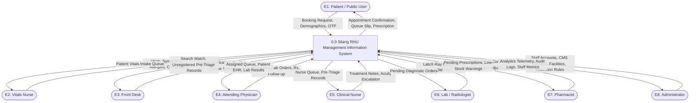

# Detailed System Documentation: Silang RHU Management Information System

> **Document Version:** 2.1  
> **System Version:** Laravel 12.x / MySQL 8.x / PHP 8.2+  
> **Total Database Tables:** 22 Application Tables (23 including Laravel Migrations)  
> **Date Updated:** August 30, 2026  
> **Authors:** Conchas, Isuga, Ripas, Takeuchi  
> **Target Audience:** System Architects, Software Engineers, Database Administrators, Capstone Defense Panelists  

---

## Table of Contents

1. [Executive Summary & System Scope](#1-executive-summary--system-scope)
2. [Technology Stack & System Architecture](#2-technology-stack--system-architecture)
3. [User Roles & Role-Based Access Control (RBAC)](#3-user-roles--role-based-access-control-rbac)
4. [Functional Modules & Operational Workflows](#4-functional-modules--operational-workflows)
   - 4.1 [Authentication, Session & Presence Module](#41-authentication-session--presence-module)
   - 4.2 [Public Portal & Content Management System (CMS)](#42-public-portal--content-management-system-cms)
   - 4.3 [Online Appointment Scheduling & Management Module](#43-online-appointment-scheduling--management-module)
   - 4.4 [Vitals Nurse / Pre-Triage Module](#44-vitals-nurse--pre-triage-module)
   - 4.5 [Front Desk & Registration Module](#45-front-desk--registration-module)
   - 4.6 [Intelligent Queueing Engine](#46-intelligent-queueing-engine)
   - 4.7 [Doctor Clinical Consultation & EHR Module](#47-doctor-clinical-consultation--ehr-module)
   - 4.8 [Clinical Nurse & Escalation Module](#48-clinical-nurse--escalation-module)
   - 4.9 [Ancillary Services Module (Laboratory & Radiology)](#49-ancillary-services-module-laboratory--radiology)
   - 4.10 [Pharmacy & Medicine Inventory Module](#410-pharmacy--medicine-inventory-module)
   - 4.11 [Administration, Analytics & Productivity Module](#411-administration-analytics--productivity-module)
   - 4.12 [Archive, Data Retention & Audit Logging Module](#412-archive-data-retention--audit-logging-module)
5. [Data Flow Diagram (DFD) Specification & Blueprint](#5-data-flow-diagram-dfd-specification--blueprint)
   - 5.1 [DFD Concepts, Symbols, and Structural Rules](#51-dfd-concepts-symbols-and-structural-rules)
   - 5.2 [How to Construct DFDs from this Documentation (Step-by-Step Guide)](#52-how-to-construct-dfds-from-this-documentation-step-by-step-guide)
   - 5.3 [External Entities Inventory](#53-external-entities-inventory)
   - 5.4 [Data Stores Inventory (D1 – D15)](#54-data-stores-inventory-d1--d15)
   - 5.5 [Process Decomposition Hierarchy (Levels 0, 1, and 2)](#55-process-decomposition-hierarchy-levels-0-1-and-2)
   - 5.6 [Context Diagram (Level 0 DFD)](#56-context-diagram-level-0-dfd)
   - 5.7 [Level 1 DFD (Subsystem Decomposition)](#57-level-1-dfd-subsystem-decomposition)
   - 5.8 [Level 2 DFDs (Detailed Sub-Processes)](#58-level-2-dfds-detailed-sub-processes)
   - 5.9 [Process-to-Data Store CRUD & Data Flow Matrix](#59-process-to-data-store-crud--data-flow-matrix)
6. [Entity Relationship Diagram (ERD) Specification & Database Schema](#6-entity-relationship-diagram-erd-specification--database-schema)
   - 6.1 [Database Structure Summary (22 Tables across 5 Functional Domains)](#61-database-structure-summary-22-tables-across-5-functional-domains)
   - 6.2 [Entity Inventory & Business Rules](#62-entity-inventory--business-rules)
   - 6.3 [Relational Cardinality & Integrity Rules](#63-relational-cardinality--integrity-rules)
   - 6.4 [Complete Mermaid Entity-Relationship Diagram](#64-complete-mermaid-entity-relationship-diagram)
   - 6.5 [Comprehensive Data Dictionary & Physical Schema (All 22 Tables)](#65-comprehensive-data-dictionary--physical-schema-all-22-tables)
7. [Technical, Hardware, Software & Environmental Specifications](#7-technical-hardware-software--environmental-specifications)
   - 7.1 [Software Specification](#71-software-specification)
   - 7.2 [Hardware Specification](#72-hardware-specification)
   - 7.3 [Program Specification](#73-program-specification)
   - 7.4 [Programming Environment](#74-programming-environment)
     - 7.4.1 [Front End Environment & Tooling](#741-front-end-environment--tooling)
     - 7.4.2 [Back End Environment & Architecture](#742-back-end-environment--architecture)
8. [Security, Privacy, and Regulatory Compliance](#8-security-privacy-and-regulatory-compliance)
9. [System Changelog & Recent Enhancements](#9-system-changelog--recent-enhancements)

---

## 1. Executive Summary & System Scope

The **Silang RHU Management Information System (RHU-MIS)** is an enterprise-grade, cloud-ready healthcare management platform engineered to automate and unify the clinical, operational, and administrative workflows of the Rural Health Unit of Silang, Cavite.

### 1.1 The Operational Bottlenecks Solved
Prior to RHU-MIS, the facility operated on decentralized paper logbooks, manual index card lookup, and handwritten paper prescriptions:
- **Prolonged Waiting Times:** Average patient turnaround exceeded **2.5 hours**, largely driven by physical folder retrieval taking up to **15 minutes per patient**.
- **Data Fragmentation & Record Duplication:** Lack of centralized identity matching caused duplicate medical folders across different visits.
- **Uncontrolled Queuing:** Patient bottlenecks at triage and doctor stations occurred due to unstratified, verbal callouts.
- **Prescription Inefficiency & Stock Blindness:** Doctors prescribed medications without real-time inventory visibility, causing pharmacy stockouts and patient redirection.

### 1.2 The RHU-MIS Solution Architecture
The RHU-MIS digitizes the end-to-end patient lifecycle:
1. **Public Web Portal & Self-Service Booking:** Online appointment scheduling with automated email OTP verification and progressive rate limiting.
2. **Pre-Triage & Vitals Acquisition:** Systematic capture of physiological parameters, chief complaints, allergies, and encoding duration.
3. **Pessimistic-Locked Registration:** Automatic duplicate detection and race-condition-safe generation of unique Patient IDs (`RHU-YYYY-XXXXX`).
4. **Intelligent Algorithmic Queueing:** Auto-routing based on patient classification (Pediatric/Adult), symptom severity (`light`, `mild`, `severe`), load balancing across active practitioners, and priority interleaving.
5. **Electronic Health Records (EHR) & Consultation:** Unified clinical documentation, state locking upon completion, and generation of permanent `MedicalCase` archives.
6. **Integrated Ancillary Workflow:** Bi-directional laboratory and radiology requests with live 3-tab queuing (Pending, Finished, Archive) and automated follow-up tagging.
7. **Closed-Loop Pharmacy & Inventory:** Automatic structured prescription transmission, batch tracking with expiration dates, and automated stock deduction upon dispensing.
8. **Compliance & Analytics:** Masking of PhilHealth identifiers (RA 10173), 10-year rolling data retention, peak-hours heatmaps, and role-segregated productivity telemetry.

---

## 2. Technology Stack & System Architecture

```
+-------------------------------------------------------------------------+
|                              PRESENTATION LAYER                         |
|   Blade Templates  |  Tailwind CSS  |  Alpine.js  |  Chart.js / Cropper |
+-------------------------------------------------------------------------+
                                    | HTTP / HTTPS / WebSockets / AJAX
+-------------------------------------------------------------------------+
|                              APPLICATION LAYER                          |
|   Laravel 12.x MVC Core  |  Role Middleware  |  Rate Limiters (Throttles)|
|   Controllers: Public, Auth, Triage, FrontDesk, Doctor, Nurse, Lab,     |
|                Pharmacy, Admin, Archive, Profile, Heartbeat, Facilities |
|   Queues & Notifications (Database Driver) | Mailables (OTP, Confirms)   |
+-------------------------------------------------------------------------+
                                    | Eloquent ORM (InnoDB Locks)
+-------------------------------------------------------------------------+
|                               DATA LAYER                                |
|   MySQL 8.x Database Engine (Pessimistic `lockForUpdate()`, Foreign     |
|   Keys, JSON Check Constraints, Soft Deletes, Rolling Retention TTL)   |
|   Total 22 Application Tables + 1 Migrations Tracking Table             |
+-------------------------------------------------------------------------+
```

### 2.1 Backend Architecture
- **Language & Framework:** PHP 8.2+ / Laravel 12.0 (Model-View-Controller)
- **Database ORM:** Eloquent ORM utilizing transactional row-level pessimistic locking (`lockForUpdate()`) for concurrency control.
- **Asynchronous Processing:** Laravel Database Queue Worker handling transactional emails and notification dispatches.
- **Security Middleware:** Custom `RoleMiddleware` enforcing multi-role route gating, session fixation guards, and rate limiters.

### 2.2 Frontend Stack
- **Templating Engine:** Laravel Blade with modular components and layout inheritance.
- **Styling:** Tailwind CSS with dedicated print media stylesheets (`@media print`) for clinical forms and queue slips.
- **Reactive UI:** Alpine.js for lightweight client-side state, modal manipulation, live search, and dynamic forms.
- **Bundler:** Vite 5.x enabling optimized module bundling and Hot Module Replacement (HMR).

### 2.3 Persistence & Storage
- **Relational Database:** MySQL 8.x with InnoDB Storage Engine (**22 Application Tables**).
- **File System Storage:** Laravel Storage subsystem managing public uploads (`/uploads/staff/`, `/uploads/announcements/`, `/uploads/lab_results/`, `/uploads/facilities/`).

---

## 3. User Roles & Role-Based Access Control (RBAC)

The system enforces strict principle-of-least-privilege access across **10 distinct user roles**:

| Role Code | Role Title | Dashboard / Landing Route | Core Operational Scope |
|---|---|---|---|
| `super_admin` | Super Administrator | `/admin/dashboard` | Unrestricted system control, CMS publication authority, audit trail, user role elevation, database retention management. |
| `admin` | Administrator | `/admin/dashboard` | Staff account provisioning, operational analytics, CMS drafting & facility management, patient master list review, retention extensions. |
| `information_desk` | Front Desk Officer | `/frontdesk/dashboard` | Patient identity verification, master registration, appointment check-in, severity assessment, queue assignment, slip generation. |
| `vitals_nurse` | Triage / Vitals Nurse | `/triage/dashboard` | Pre-triage vitals recording, clinical history intake, allergy logging, walk-in/appointment identification. |
| `regular_doctor` | General / Adult Physician | `/doctor/dashboard` | Adult consultation queue management, clinical diagnosis, structured prescription generation, lab/imaging orders, follow-up flags. |
| `pedia_doctor` | Pediatrician | `/doctor/dashboard` | Dedicated pediatric queue consultation, guardian-linked clinical documentation, pediatric dosage ordering. |
| `clinical_nurse` | Clinical / Treatment Nurse | `/nurse/dashboard` | Low-to-mild acuity consultations, minor treatments, triage escalation / forwarding to attending physicians. |
| `laboratory` | Laboratory Technician | `/lab/dashboard` | Processing ancillary lab orders (CBC, Urinalysis, Fecalysis, Blood Chemistry, Blood Typing), result attachment, 3-tab queuing. |
| `radiology` | Radiologic Technologist | `/lab/dashboard` | Processing imaging orders (X-ray, Ultrasound), recording radiology findings, diagnostic image uploads. |
| `pharmacy` | Pharmacist / Dispenser | `/pharmacy/dashboard` | Reviewing pending electronic prescriptions, batch-level stock allocation, dispensing validation, medicine inventory management. |

---

## 4. Functional Modules & Operational Workflows

### 4.1 Authentication, Session & Presence Module
- **Dual-Tier Rate Limiting:**
  - *Per-Email Throttle:* 5 failed attempts per 10 minutes (locks individual target account).
  - *Per-IP Throttle:* 5 attempts per 5 minutes (mitigates distributed brute-force attacks).
- **Session Security:** Session IDs are regenerated upon login (`$request->session()->regenerate()`) to neutralize session fixation. Logout invalidates sessions and regenerates CSRF tokens.
- **Real-Time Staff Presence Tracking:** Client-side JavaScript dispatches an authenticated heartbeat ping every 60 seconds (`/heartbeat`). A user is evaluated as `Present` if manually flagged or if heartbeat activity occurred within the active threshold window.

### 4.2 Public Portal & Content Management System (CMS)
- **Public Directory:** Displays published municipal health announcements, operating unit profiles (Main Health Center, Lying-in Clinic, Dental Clinic, TB DOTS Facility, Animal Bite Center, OB-GYN Unit), and active doctor schedules.
- **Dynamic Facilities CMS:** Full administrative CRUD in CMS allows adding and updating municipal health units and specialty clinics dynamically (`FacilityUnit` model).
- **Two-Tier CMS Publication:** Standard administrators can author announcements in `draft` or `pending` status. Only `super_admin` accounts hold the authorization to change status to `published`.
- **Rich Media & Infographics:** Announcements support structured gallery slides, multi-section content layouts (`left`, `right`, `middle`), direct MP4 video hosting, and external video embedding.

### 4.3 Online Appointment Scheduling & Management Module
- **Service Streams:**
  - *Pediatric Booking:* For patients aged 0–12; mandates guardian identification and PhilHealth routing.
  - *Adult Follow-Up Booking:* Enforces historical validation by verifying that the patient has a prior consultation record flagged with `is_followup_needed = true` within a valid 3-month window.
- **Email OTP Verification:** Cryptographic 6-digit one-time PIN sent via email, cached for 10 minutes.
- **Capacity Throttling:** Enforces configurable clinic-wide caps (default 20 slots/day for Pedia) with doctor schedule validation.

### 4.4 Vitals Nurse / Pre-Triage Module
- **Physiological Parameter Capture:** Temperature (°C), Blood Pressure (systolic/diastolic mmHg), Weight (kg), Height (cm), Heart Rate (bpm), Respiratory Rate (cpm), Pulse Rate (bpm), and Oxygen Saturation ($SpO_2$ %).
- **Clinical Intake:** Chief complaint, descriptive symptoms, past medical history, current medications, known drug/food allergies.
- **Efficiency Telemetry:** Tracks encoding duration in seconds (`encoding_duration_seconds`) to calculate nurse workflow performance.

### 4.5 Front Desk & Registration Module
- **Identity Matching:** Searches existing records by first name, last name, date of birth, and contact number.
- **Pessimistic-Locked ID Generation:** Wraps `Patient::max('id')` within `DB::transaction()` and `lockForUpdate()` to guarantee atomic formatting (`RHU-YYYY-XXXXX`).
- **Severity Stratification:** Front desk classifies patients into `light`, `mild`, or `severe` to dictate algorithmic queue routing.

### 4.6 Intelligent Queueing Engine
- **Prefix Conventions:**
  - `REG-XXX`: Regular Adult walk-ins
  - `PRI-XXX`: Senior Citizen and PWD priority walk-ins
  - `PED-XXX`: Pediatric walk-ins
  - `APED-XXX`: Booked Pediatric appointments
  - `PED-E-XXX`: Pediatric emergencies
- **Interleaving Ratios:**
  - *Adult Queue:* 2 Priority (Senior/PWD) : 1 Regular
  - *Pediatric Queue:* 1 Emergency (top priority) &rarr; 2 Appointments (`APED`) : 1 Walk-in (`PED`)
- **Load Balancing:** Automatically distributes patients across logged-in physicians (`Present` status).
- **Wait-Time Conversion:** Queue indicators dynamically convert minutes to hours (`1h 15m wait`) when waiting exceeds 60 minutes.

### 4.7 Doctor Clinical Consultation & EHR Module
- **Clinical Interface:** Displays patient demographics, pre-triage vitals, historical visit records, and active lab orders.
- **Result-Ready Queue Priority:** Consultations waiting for diagnostic results move to the front of the queue with an animated `✓ Results Ready` badge upon lab submission.
- **Auto Follow-Up on Pending Ancillary:** Completing a consultation while diagnostic orders remain pending automatically flags the patient for a **Follow-up Visit** (`is_followup_needed = true`).
- **Legal EHR Immutability:** Completing a consultation locks clinical fields and generates a permanent `MedicalCase` record.

### 4.8 Clinical Nurse & Escalation Module
- **Minor Treatment Protocol:** Nurse consultation room allows recording treatment notes, diagnoses, and OTC medicine recommendations for mild complaints.
- **Doctor Escalation:** Acuity worsening allows immediate escalation to the active Doctor queue.

### 4.9 Ancillary Services Module (Laboratory & Radiology)
- **3-Tab Queue Interface:**
  - *Pending:* Active diagnostic requests (same-day prioritized over backlog) with 1-click No-Show Archive.
  - *Finished:* Completed requests (last 7 days) with structured modal viewer and file download.
  - *Archive:* Manually archived no-shows and unfulfilled past-date requests with **Restore to Pending** capability.
- **Standardized Diagnostic Form Entry:**
  - *Hematology / CBC:* Full parameter suite (RBC, Hemoglobin with M/F ranges, Hematocrit, MCV, MCH, MCHC, WBC, Differential Count: Neutrophil, Lymphocyte, Monocyte, Eosinophil, Basophil, Nucleated RBC, ESR, Bleeding/Clotting time, Platelet Count).
  - *Blood Typing:* ABO group and Rh factor determination.
  - *Clinical Urinalysis:* Physical, chemical, and microscopic examination fields.
  - *Routine Fecalysis:* Color, consistency, microscopic pus/RBC, ova/parasites, occult blood.
  - *Blood Chemistry Profile:* Fasting blood sugar (FBS), cholesterol, triglycerides, uric acid, creatinine, SGPT/ALT.
  - *Radiology (X-Ray):* Views, 1-click **Normal Chest Template**, radiological impressions, and DICOM/imaging uploads.

### 4.10 Pharmacy & Medicine Inventory Module
- **Closed-Loop E-Prescribing:** Prescriptions authored by doctors automatically appear in real-time on the Pharmacy dashboard.
- **Batch-Level FIFO Tracking:** Medicines tracked with batch numbers and expiration dates to enforce First-In, First-Out dispensing.
- **Inventory Audit Trail:** Logs additions, dispenses, expirations, and manual adjustments in `inventory_logs`.

### 4.11 Administration, Analytics & Productivity Module
- **Interactive Telemetry:** Peak arrival heatmaps, diagnostic volume graphs, and epidemiological disease trends via Chart.js.
- **Staff Productivity:** Average consultation durations, triage turnaround, and dispensing counts per staff member.

### 4.12 Archive, Data Retention & Audit Logging Module
- **10-Year Rolling Data Retention:** RA 10173 and DOH compliance; every patient record update resets `expires_at` 10 years forward.
- **Soft Deletion & Vault Recovery:** Soft-deleted accounts and CMS items are restorable via the Archive Vault.
- **Comprehensive Audit Trail:** Logs user actions, models touched, IP addresses, user agents, and JSON diffs.

---

## 5. Data Flow Diagram (DFD) Specification & Blueprint

### 5.1 DFD Concepts, Symbols, and Structural Rules
- **External Entities (Squares):** Originators and terminators of data outside system boundaries (`E1`–`E8`).
- **Processes (Rounded Rectangles):** Data transformation functions (`P1.0`–`P8.0`).
- **Data Stores (Open Rectangles):** Persistent repositories (`D1`–`D15`).
- **Data Flows (Arrows):** Named vectors transferring specific data attributes.

### 5.2 How to Construct DFDs from this Documentation (Step-by-Step Guide)
1. **Level 0 (Context Diagram):** Place the central `0.0 Silang RHU-MIS` process, surrounded by external entities (`E1`–`E8`), connecting input/output data flows.
2. **Level 1 (Subsystem Decomposition):** Expand `0.0` into 8 major processes (`1.0` to `8.0`) connected to data stores `D1` through `D15`.
3. **Level 2 (Functional Deep-Dives):** Decompose complex subsystems (e.g., `P2.0 Registration`, `P4.0 Clinical Consultation`, `P6.0 Ancillary`) into child processes (`P2.1`–`P2.4`, `P6.1`–`P6.4`).

### 5.3 External Entities Inventory
- `E1`: Patient / Public User
- `E2`: Vitals / Triage Nurse
- `E3`: Front Desk Officer
- `E4`: Attending Physician (Regular & Pedia Doctor)
- `E5`: Clinical Treatment Nurse
- `E6`: Laboratory Technician / Radiologist
- `E7`: Pharmacist / Dispenser
- `E8`: Administrator / Super Administrator

### 5.4 Data Stores Inventory (D1 – D15)
- `D1`: Patients Master Index (`patients`)
- `D2`: Appointments Repository (`appointments`)
- `D3`: Pre-Triage Clinical Vitals (`pre_triages`)
- `D4`: Daily Physical Queue (`queues`)
- `D5`: Consultations Active State (`consultations`)
- `D6`: Medical Cases Vault (`medical_cases`)
- `D7`: Ancillary Diagnostic Requests (`ancillary_requests`)
- `D8`: Electronic Prescriptions (`prescriptions`, `prescription_items`)
- `D9`: Pharmaceutical Inventory (`medicines`, `medicine_batches`, `inventory_logs`)
- `D10`: User Accounts & RBAC (`users`)
- `D11`: Practitioner Shift Schedules (`practitioner_schedules`)
- `D12`: Public CMS & Announcements (`announcements`, `announcement_images`, `services`)
- `D13`: System Configuration & Settings (`site_settings`)
- `D14`: Dynamic Health Facility Units (`facility_units`)
- `D15`: Security Audit Logs & Notifications (`audit_logs`, `notifications`, `password_reset_tokens`)

### 5.5 Process Decomposition Hierarchy
```
0.0 Silang RHU Management Information System
  ├── 1.0 Online Appointment Scheduling & Management
  │     ├── 1.1 OTP Email Verification
  │     ├── 1.2 Capacity & Schedule Evaluation
  │     ├── 1.3 Follow-up Eligibility Validation
  │     └── 1.4 Appointment Booking & Confirmation Dispatch
  ├── 2.0 Patient Intake, Pre-Triage & Master Registration
  │     ├── 2.1 Pre-Triage Vitals Acquisition
  │     ├── 2.2 Master Patient Search & Identity Matching
  │     ├── 2.3 Pessimistic-Locked Master Registration
  │     └── 2.4 Acuity Classification & Ticket Generation
  ├── 3.0 Intelligent Queue Routing & Load Balancing
  │     ├── 3.1 Practitioner Presence Verification
  │     ├── 3.2 Algorithmic Queue Sorting & Interleaving
  │     └── 3.3 Dynamic Wait-Time Calculation
  ├── 4.0 Clinical Consultation & Electronic Health Records (EHR)
  │     ├── 4.1 Medical History & Vitals Evaluation
  │     ├── 4.2 Diagnostic & Ancillary Test Ordering
  │     ├── 4.3 Electronic Prescription Authoring
  │     └── 4.4 Consultation Completion & Medical Case Archiving
  ├── 5.0 Clinical Nurse Treatment & Acuity Escalation
  │     ├── 5.1 Minor Clinical Care & Documentation
  │     └── 5.2 Physician Escalation Protocol
  ├── 6.0 Ancillary Diagnostic Processing (Lab & Radiology)
  │     ├── 6.1 3-Tab Queue Partitioning (Pending/Finished/Archive)
  │     ├── 6.2 Standardized Clinical Result Entry & File Upload
  │     ├── 6.3 No-Show Request Archiving & Restoration
  │     └── 6.4 Consultation Status Update (Results Ready)
  ├── 7.0 Pharmaceutical Inventory & E-Prescription Dispensing
  │     ├── 7.1 Prescription Validation & Queueing
  │     ├── 7.2 FIFO Batch Selection & Stock Deduction
  │     └── 7.3 Inventory Reorder & Expiration Logging
  └── 8.0 System Administration, CMS & Compliance
        ├── 8.1 Staff Provisioning & Role Management
        ├── 8.2 CMS Announcements & Facility Units Management
        ├── 8.3 Operational Analytics & Telemetry Reporting
        └── 8.4 10-Year Rolling Data Retention & Audit Logging
```

### 5.6 Context Diagram (Level 0 DFD)


---

## 6. Entity Relationship Diagram (ERD) Specification & Database Schema

### 6.1 Database Structure Summary (22 Tables across 5 Functional Domains)

The RHU-MIS relational schema is composed of **22 application database tables** (and 1 system migrations table) categorized into 5 distinct operational domains:

```
+---------------------------------------------------------------------------------------------------+
|                                  DATABASE DOMAIN MATRIX (22 TABLES)                                |
+---------------------------------------------------------------------------------------------------+
| 1. Clinical Encounters (6)   : patients, pre_triages, consultations, medical_cases,               |
|                                appointments, queues                                               |
| 2. Ancillary Diagnostics (1) : ancillary_requests                                                |
| 3. Pharmacy & Inventory (5)  : prescriptions, prescription_items, medicines,                      |
|                                medicine_batches, inventory_logs                                   |
| 4. Facilities & CMS (5)      : facility_units, services, announcements,                           |
|                                announcement_images, site_settings                                 |
| 5. Security & System (5)     : users, practitioner_schedules, password_reset_tokens,              |
|                                notifications, audit_logs                                          |
+---------------------------------------------------------------------------------------------------+
```

### 6.2 Entity Inventory & Business Rules
1. **`patients`**: Master demographic and medical identity record indexed by unique `patient_id`.
2. **`consultations`**: Clinical examination records linked to attending physician, vitals, and queue.
3. **`pre_triages`**: Physiological vitals snapshots recorded during initial nurse triage.
4. **`medical_cases`**: Permanent, immutable legal medical case records.
5. **`appointments`**: Online patient bookings with reference tokens.
6. **`queues`**: Daily physical queue sequencing tickets.
7. **`ancillary_requests`**: Diagnostic test requests with 3-tab lifecycle (`Pending`, `Done`, `archived_at`).
8. **`prescriptions` & `prescription_items`**: Electronic prescription orders with line items.
9. **`medicines`, `medicine_batches` & `inventory_logs`**: Multi-batch inventory with FIFO expiration enforcement.
10. **`facility_units`**: Dynamic municipal health facilities and specialty clinics.
11. **`services`**: Public municipal health programs and service procedures.
12. **`announcements` & `announcement_images`**: CMS content articles and gallery sections.
13. **`users` & `practitioner_schedules`**: Staff accounts, roles, presence heartbeat, and shift hours.
14. **`password_reset_tokens` & `notifications`**: Authentication security tokens and system notifications.
15. **`site_settings` & `audit_logs`**: System key-value configuration and tamper-evident audit trail.

### 6.3 Relational Cardinality & Integrity Rules
- **`patients` to `consultations` (1 : N):** One patient holds many historical consultation records.
- **`patients` to `medical_cases` (1 : N):** One patient holds many permanent case archives.
- **`consultations` to `pre_triages` (1 : 1):** Each consultation links to exactly one pre-triage record.
- **`consultations` to `medical_cases` (1 : 1):** Completing a consultation generates exactly one immutable medical case.
- **`consultations` to `ancillary_requests` (1 : N):** One consultation can order multiple diagnostic tests.
- **`consultations` to `prescriptions` (1 : 1):** One consultation produces zero or one electronic prescription.
- **`prescriptions` to `prescription_items` (1 : N):** One prescription contains one or many prescribed drugs.
- **`medicines` to `medicine_batches` (1 : N):** A medicine has multiple stock batches with expiration dates.
- **`medicines` to `inventory_logs` (1 : N):** All stock movements are logged against the parent medicine.
- **`announcements` to `announcement_images` (1 : N):** CMS articles contain multiple media sections.
- **`users` to `audit_logs` (1 : N):** User actions generate security audit logs.

### 6.4 Complete Mermaid Entity-Relationship Diagram

```mermaid
erDiagram
    users ||--o{ consultations : "assigned_doctor"
    users ||--o{ consultations : "assigned_nurse"
    users ||--o{ pre_triages : "recorded_by"
    users ||--o{ audit_logs : "performed_by"
    users ||--o{ inventory_logs : "logged_by"
    users ||--o{ practitioner_schedules : "has_schedule"
    users ||--o{ ancillary_requests : "completed_by"

    patients ||--o{ consultations : "attends"
    patients ||--o{ medical_cases : "owns_cases"
    patients ||--o{ queues : "queued_as"
    patients ||--o{ prescriptions : "receives"

    appointments }o--|| pre_triages : "links_to"

    pre_triages ||--o| consultations : "provides_vitals"
    consultations ||--|| medical_cases : "spawns_archive"
    consultations ||--o{ ancillary_requests : "orders_tests"
    consultations ||--o| prescriptions : "generates"

    prescriptions ||--|{ prescription_items : "contains"
    medicines ||--o{ prescription_items : "references"
    medicines ||--|{ medicine_batches : "stocked_in"
    medicines ||--o{ inventory_logs : "tracked_via"
    medicine_batches ||--o{ inventory_logs : "batch_logged"

    announcements ||--o{ announcement_images : "contains_media"

    patients {
        bigint id PK
        string patient_id UK "RHU-YYYY-XXXXX"
        string first_name
        string middle_name
        string last_name
        string suffix
        enum sex "Male, Female"
        date dob
        string civil_status
        string blood_type
        text known_allergies
        text address
        string barangay
        string city_province
        string contact_number
        string email
        string philhealth_number "Encrypted/Masked"
        string classification "Adult, Senior, PWD, Pediatric"
        string guardian_name
        string guardian_relation
        string guardian_contact
        text guardian_philhealth
        timestamp expires_at "10-Year Rolling"
        timestamp deleted_at "SoftDeletes"
    }

    consultations {
        bigint id PK
        string patient_id FK
        bigint doctor_id FK
        bigint nurse_id FK
        bigint pre_triage_id FK
        date consultation_date
        string queue_number
        string status "queued, active, awaiting_results, results_ready, completed"
        string severity "light, mild, severe"
        text diagnosis
        text prescription
        text medical_notes
        boolean is_followup_needed
        date followup_date
        string followup_reason
        bigint followup_doctor_id FK
        timestamp consultation_start_time
        timestamp consultation_end_time
        string blood_pressure
        string temperature
        string weight
        string height
        string heart_rate
        string respiratory_rate
        string pulse_rate
        string spo2
    }

    pre_triages {
        bigint id PK
        string patient_name
        string patient_id FK
        bigint appointment_id FK
        bigint recorded_by FK
        decimal temperature
        string blood_pressure
        decimal weight
        decimal height
        int heart_rate
        int respiratory_rate
        int pulse_rate
        int oxygen_saturation
        string chief_complaint
        text symptoms
        text past_medical_history
        text medicine_taken
        text known_allergies
        string classification
        enum status "waiting, claimed, cancelled, completed"
        int encoding_duration_seconds
        boolean is_emergency
    }

    medical_cases {
        bigint id PK
        string case_number UK "CASE-YYYYMMDD-XXXXX"
        string patient_id FK
        bigint consultation_id FK
        bigint pre_triage_id FK
        text diagnosis
        text prescription
        json vitals_snapshot "Immutable Snapshot"
        timestamp closed_at
    }

    appointments {
        bigint id PK
        string reference_number UK "APT-XXXXXXXX"
        string first_name
        string last_name
        string email
        string contact_number
        enum type "pedia, adult"
        datetime preferred_date
        string preferred_time
        boolean is_follow_up
        enum status "pending, approved, rescheduled, cancelled, arrived, triaged, registered, done"
        boolean data_privacy_agreed
    }

    queues {
        bigint id PK
        string patient_id FK
        string queue_number "REG-001, PRI-001, PED-001, PED-E-001"
        string priority_type "Regular, Senior, PWD, Emergency"
        string service_type
        enum status "Waiting, Called, Serving, Completed"
        timestamp called_at
    }

    ancillary_requests {
        bigint id PK
        bigint consultation_id FK
        enum type "Laboratory, Radiology"
        string test_name
        enum status "Pending, Done"
        text remarks
        json result_data "Structured Clinical Findings"
        string result_file_path
        bigint completed_by FK
        timestamp completed_at
        timestamp archived_at "No-Show Archive"
        string archived_reason "manual, auto"
    }

    prescriptions {
        bigint id PK
        bigint consultation_id FK
        string patient_id FK
        bigint doctor_id FK
        enum status "pending, dispensed"
    }

    prescription_items {
        bigint id PK
        bigint prescription_id FK
        bigint medicine_id FK
        string medicine_name
        string dosage
        string frequency
        string duration
        int quantity
    }

    medicines {
        bigint id PK
        string name
        string generic_name
        string form "Tablet, Syrup, Capsule"
        string category
        string unit
    }

    medicine_batches {
        bigint id PK
        bigint medicine_id FK
        string batch_number
        date expiration_date
        int quantity
        int original_quantity
    }

    inventory_logs {
        bigint id PK
        bigint medicine_id FK
        bigint batch_id FK
        string action "Added, Dispensed, Expired, Adjusted"
        int quantity_changed
        string remarks
        bigint performed_by FK
    }

    facility_units {
        bigint id PK
        string name
        string slug UK
        text description
        string category
        string operating_hours
        string contact_number
        string location
        string image_path
        json services_offered
        boolean is_active
        int sort_order
    }

    users {
        bigint id PK
        string name
        string email UK
        string password
        string role "super_admin, admin, regular_doctor, pedia_doctor, clinical_nurse, vitals_nurse, information_desk, laboratory, radiology, pharmacy"
        string status "Present, Absent, On Leave"
        string avatar_path
        timestamp last_activity_at "Heartbeat Telemetry"
        timestamp deleted_at "SoftDeletes"
    }

    announcements {
        bigint id PK
        string title
        string subheading
        date event_date
        time start_time
        longtext content
        string image_path
        string display_type "list, carousel"
        enum display_mode "standard, infographic"
        enum status "draft, pending, published"
        timestamp deleted_at "SoftDeletes"
    }

    announcement_images {
        bigint id PK
        bigint announcement_id FK
        string image_path
        text video_url
        enum layout "left, right, middle"
        enum media_type "image, video_upload, video_link"
        longtext content
        int sort_order
    }

    audit_logs {
        bigint id PK
        bigint user_id FK
        string action
        string model_type
        string model_id
        json changes
        string ip_address
        text user_agent
    }
```



---

### 6.5 Comprehensive Data Dictionary & Physical Schema (All 22 Tables)

#### 6.5.1 Table: `patients`
| Column | Type | Nullable | Key / Constraints | Description |
|---|---|---|---|---|
| `id` | `BIGINT UNSIGNED` | No | PK, Auto Increment | Primary internal database ID. |
| `patient_id` | `VARCHAR(255)` | No | Unique Index | Human-readable ID formatted as `RHU-YYYY-XXXXX`. |
| `first_name` | `VARCHAR(255)` | No | — | First name of the patient (Title Cased). |
| `middle_name` | `VARCHAR(255)` | Yes | — | Middle name (optional). |
| `last_name` | `VARCHAR(255)` | No | — | Last name of the patient. |
| `suffix` | `VARCHAR(20)` | Yes | — | Name suffix (Jr., Sr., III, etc.). |
| `sex` | `ENUM('Male','Female')` | Yes | — | Biological sex. |
| `dob` | `DATE` | No | — | Date of birth. |
| `civil_status` | `VARCHAR(255)` | Yes | — | Single, Married, Widowed, etc. |
| `blood_type` | `VARCHAR(255)` | Yes | — | A+, B+, O+, AB+, etc. |
| `known_allergies` | `TEXT` | Yes | — | Drug, food, and environmental allergies. |
| `address` | `TEXT` | No | — | Full street and residential address. |
| `barangay` | `VARCHAR(255)` | Yes | — | Barangay of residence in Silang. |
| `city_province` | `VARCHAR(255)` | No | Default: `'Silang, Cavite'` | Municipality and province. |
| `contact_number` | `VARCHAR(255)` | Yes | — | 11-digit mobile contact number (`09XXXXXXXXX`). |
| `email` | `VARCHAR(255)` | Yes | — | Validated email address. |
| `philhealth_number` | `TEXT` | Yes | — | Masked/Encrypted PhilHealth ID (`XX-XXXXXXXXX-X`). |
| `classification` | `VARCHAR(255)` | Yes | — | `Regular Adult`, `Senior Citizen`, `PWD`, `Pediatric`. |
| `guardian_name` | `VARCHAR(255)` | Yes | — | Full name of guardian (mandatory for Pediatric). |
| `guardian_relation` | `VARCHAR(255)` | Yes | — | Parent, Grandparent, Relative, etc. |
| `guardian_contact` | `VARCHAR(255)` | Yes | — | Guardian mobile phone number. |
| `guardian_philhealth` | `TEXT` | Yes | — | Guardian PhilHealth ID for pediatric coverage. |
| `registered_by` | `BIGINT UNSIGNED` | Yes | FK &rarr; `users.id` | Front desk officer who registered the record. |
| `expires_at` | `TIMESTAMP` | Yes | Index | 10-year rolling data retention expiration timestamp. |
| `deleted_at` | `TIMESTAMP` | Yes | — | Soft-delete timestamp. |
| `created_at` / `updated_at` | `TIMESTAMP` | Yes | — | Standard Laravel timestamps. |

#### 6.5.2 Table: `pre_triages`
| Column | Type | Nullable | Key / Constraints | Description |
|---|---|---|---|---|
| `id` | `BIGINT UNSIGNED` | No | PK, Auto Increment | Primary key. |
| `patient_name` | `VARCHAR(255)` | No | — | Full name recorded at triage. |
| `patient_id` | `VARCHAR(255)` | Yes | FK &rarr; `patients.patient_id` | Foreign key linking patient master record. |
| `appointment_id` | `BIGINT UNSIGNED` | Yes | FK &rarr; `appointments.id` | Originating online booking ID. |
| `recorded_by` | `BIGINT UNSIGNED` | No | FK &rarr; `users.id` | Attending triage nurse ID. |
| `temperature` | `DECIMAL(4,1)` | Yes | — | Body temperature in Celsius. |
| `blood_pressure` | `VARCHAR(255)` | Yes | — | Systolic/Diastolic blood pressure (mmHg). |
| `weight` | `DECIMAL(5,2)` | Yes | — | Body weight in kilograms. |
| `height` | `DECIMAL(5,2)` | Yes | — | Height in centimeters. |
| `heart_rate` | `INT` | Yes | — | Heart rate in beats per minute (bpm). |
| `respiratory_rate` | `INT` | Yes | — | Breaths per minute (cpm). |
| `pulse_rate` | `INT` | Yes | — | Pulse rate (bpm). |
| `oxygen_saturation` | `INT` | Yes | — | Blood oxygen saturation ($SpO_2$ %). |
| `chief_complaint` | `VARCHAR(255)` | Yes | — | Primary clinical complaint. |
| `symptoms` | `TEXT` | Yes | — | Narrative description of patient symptoms. |
| `past_medical_history` | `TEXT` | Yes | — | Pre-existing conditions and medical history. |
| `medicine_taken` | `TEXT` | Yes | — | Current medications consumed by patient. |
| `known_allergies` | `TEXT` | Yes | — | Reported drug/food allergies. |
| `classification` | `VARCHAR(255)` | No | Default: `'Adult'` | Pediatric vs Adult triage category. |
| `status` | `ENUM` | No | Default: `'waiting'` | `waiting`, `claimed`, `cancelled`, `completed`. |
| `encoding_duration_seconds`| `INT` | Yes | — | Nurse form completion duration in seconds. |
| `is_emergency` | `TINYINT(1)` | No | Default: `0` | Acute emergency priority override flag. |

#### 6.5.3 Table: `consultations`
| Column | Type | Nullable | Key / Constraints | Description |
|---|---|---|---|---|
| `id` | `BIGINT UNSIGNED` | No | PK, Auto Increment | Primary key. |
| `patient_id` | `VARCHAR(255)` | No | FK &rarr; `patients.patient_id` | Foreign key linking patient. |
| `doctor_id` | `BIGINT UNSIGNED` | Yes | FK &rarr; `users.id` | Attending physician ID. |
| `nurse_id` | `BIGINT UNSIGNED` | Yes | FK &rarr; `users.id` | Attending clinical nurse ID. |
| `pre_triage_id` | `BIGINT UNSIGNED` | Yes | FK &rarr; `pre_triages.id` | Originating pre-triage vitals record. |
| `consultation_date` | `DATE` | Yes | Index | Calendar date of consultation. |
| `queue_number` | `VARCHAR(255)` | No | — | Assigned ticket number (e.g., `REG-001`). |
| `status` | `VARCHAR(255)` | No | Default: `'queued'` | `queued`, `active`, `awaiting_results`, `results_ready`, `completed`. |
| `severity` | `VARCHAR(255)` | Yes | — | `light`, `mild`, `severe`. |
| `diagnosis` | `TEXT` | Yes | — | Free-text clinical diagnosis. |
| `prescription` | `TEXT` | Yes | — | Clinical prescription summary. |
| `medical_notes` | `TEXT` | Yes | — | Treatment notes and physician observations. |
| `is_followup_needed` | `TINYINT(1)` | No | Default: `0` | Flag indicating follow-up requirement (auto-flagged on pending labs). |
| `followup_date` | `DATE` | Yes | — | Target return date. |
| `followup_reason` | `VARCHAR(255)` | Yes | — | Clinical rationale for follow-up consult. |
| `followup_doctor_id` | `BIGINT UNSIGNED` | Yes | FK &rarr; `users.id` | Doctor specified for follow-up consult. |
| `consultation_start_time` | `TIMESTAMP` | Yes | — | Timestamp when consultation began. |
| `consultation_end_time` | `TIMESTAMP` | Yes | — | Timestamp when consultation was completed. |
| `blood_pressure` | `VARCHAR(255)` | Yes | — | Denormalized vitals snapshot. |
| `temperature` | `VARCHAR(255)` | Yes | — | Denormalized vitals snapshot (°C). |
| `weight` / `height` | `VARCHAR(255)` | Yes | — | Weight (kg) / Height (cm) snapshot. |
| `heart_rate` / `pulse_rate` | `VARCHAR(255)` | Yes | — | Cardiac rate snapshots. |
| `spo2` | `VARCHAR(255)` | Yes | — | Oxygen saturation snapshot. |

#### 6.5.4 Table: `medical_cases`
| Column | Type | Nullable | Key / Constraints | Description |
|---|---|---|---|---|
| `id` | `BIGINT UNSIGNED` | No | PK, Auto Increment | Primary key. |
| `case_number` | `VARCHAR(255)` | No | Unique Index | Formatted legal case number (`CASE-YYYYMMDD-XXXXX`). |
| `patient_id` | `VARCHAR(255)` | No | FK &rarr; `patients.patient_id` | Foreign key linking patient. |
| `consultation_id` | `BIGINT UNSIGNED` | No | FK &rarr; `consultations.id` | Originating consultation visit. |
| `pre_triage_id` | `BIGINT UNSIGNED` | No | FK &rarr; `pre_triages.id` | Baseline vitals intake record. |
| `diagnosis` | `TEXT` | Yes | — | Final physician clinical diagnosis. |
| `prescription` | `TEXT` | Yes | — | Prescribed medical regimen. |
| `vitals_snapshot` | `JSON` | Yes | — | Immutable JSON snapshot of all patient vitals. |
| `closed_at` | `TIMESTAMP` | No | Default: `CURRENT_TIMESTAMP` | Legal case closure timestamp. |

#### 6.5.5 Table: `appointments`
| Column | Type | Nullable | Key / Constraints | Description |
|---|---|---|---|---|
| `id` | `BIGINT UNSIGNED` | No | PK, Auto Increment | Primary key. |
| `reference_number` | `VARCHAR(255)` | Yes | Unique Index | Public reference token (`APT-XXXXXXXX`). |
| `first_name` / `last_name` | `VARCHAR(255)` | No | — | Patient name fields. |
| `email` | `VARCHAR(255)` | No | — | Patient email for OTP verification. |
| `contact_number` | `VARCHAR(11)` | Yes | — | Mobile contact number. |
| `type` | `ENUM('pedia','adult')`| No | — | Clinical service division. |
| `preferred_date` | `DATETIME` | No | — | Selected appointment date. |
| `preferred_time` | `VARCHAR(255)` | Yes | — | Selected time slot. |
| `is_follow_up` | `TINYINT(1)` | No | Default: `0` | Follow-up visit flag. |
| `status` | `ENUM` | No | Default: `'pending'` | `pending`, `approved`, `rescheduled`, `cancelled`, `arrived`, `triaged`, `registered`, `done`. |
| `data_privacy_agreed` | `TINYINT(1)` | No | — | RA 10173 legal consent flag. |

#### 6.5.6 Table: `queues`
| Column | Type | Nullable | Key / Constraints | Description |
|---|---|---|---|---|
| `id` | `BIGINT UNSIGNED` | No | PK, Auto Increment | Primary key. |
| `patient_id` | `VARCHAR(255)` | No | FK &rarr; `patients.patient_id` | Foreign key linking patient. |
| `queue_number` | `VARCHAR(255)` | No | — | Formatted ticket number (`REG-001`, `PRI-001`, `PED-001`, `PED-E-001`). |
| `priority_type` | `VARCHAR(255)` | No | — | `Regular`, `Senior`, `PWD`, `Emergency`. |
| `service_type` | `VARCHAR(255)` | No | Default: `'Consultation'` | Clinical station service. |
| `status` | `VARCHAR(255)` | No | Default: `'Waiting'` | `Waiting`, `Called`, `Serving`, `Completed`. |
| `called_at` | `TIMESTAMP` | Yes | — | Time when ticket was called by clinician. |

#### 6.5.7 Table: `ancillary_requests`
| Column | Type | Nullable | Key / Constraints | Description |
|---|---|---|---|---|
| `id` | `BIGINT UNSIGNED` | No | PK, Auto Increment | Primary key. |
| `consultation_id` | `BIGINT UNSIGNED` | No | FK &rarr; `consultations.id` | Parent clinical consultation. |
| `type` | `ENUM('Laboratory','Radiology')` | No | Index | Service diagnostic division. |
| `test_name` | `VARCHAR(255)` | No | — | CBC, Urinalysis, Fecalysis, Blood Chemistry, X-Ray, etc. |
| `status` | `ENUM('Pending','Done')` | No | Default: `'Pending'` | Fulfillment state. |
| `remarks` | `TEXT` | Yes | — | Physician clinical instructions. |
| `result_data` | `JSON` | Yes | — | Structured findings (e.g. Hemoglobin, RBC, WBC, Protein, Glucose). |
| `result_file_path` | `VARCHAR(255)` | Yes | — | Uploaded medical scan/PDF path. |
| `completed_by` | `BIGINT UNSIGNED` | Yes | FK &rarr; `users.id` | Laboratory/Radiology technician ID. |
| `completed_at` | `TIMESTAMP` | Yes | Index | Time when results were submitted. |
| `archived_at` | `TIMESTAMP` | Yes | Index | Timestamp when archived as no-show. |
| `archived_reason` | `VARCHAR(255)` | Yes | — | `manual`, `no_show`, `expired`. |

#### 6.5.8 Table: `prescriptions` & `prescription_items`
| Table | Column | Type | Constraints | Description |
|---|---|---|---|---|
| `prescriptions` | `id` | `BIGINT UNSIGNED` | PK | Primary key. |
| `prescriptions` | `consultation_id` | `BIGINT UNSIGNED` | FK &rarr; `consultations.id` | Linked consultation visit. |
| `prescriptions` | `patient_id` | `VARCHAR(255)` | FK &rarr; `patients.patient_id` | Patient reference. |
| `prescriptions` | `doctor_id` | `BIGINT UNSIGNED` | FK &rarr; `users.id` | Authoring physician. |
| `prescriptions` | `status` | `ENUM('pending','dispensed')` | Default: `'pending'` | Pharmacy fulfillment state. |
| `prescription_items` | `id` | `BIGINT UNSIGNED` | PK | Primary key. |
| `prescription_items` | `prescription_id` | `BIGINT UNSIGNED` | FK &rarr; `prescriptions.id` | Parent prescription record. |
| `prescription_items` | `medicine_id` | `BIGINT UNSIGNED` | FK &rarr; `medicines.id` | Master medicine catalog link. |
| `prescription_items` | `medicine_name` | `VARCHAR(255)` | — | Prescribed drug name. |
| `prescription_items` | `dosage` | `VARCHAR(255)` | — | e.g., "500mg". |
| `prescription_items` | `frequency` | `VARCHAR(255)` | — | e.g., "3x daily after meals". |
| `prescription_items` | `duration` | `VARCHAR(255)` | — | e.g., "7 days". |
| `prescription_items` | `quantity` | `INT` | — | Total unit count prescribed. |

#### 6.5.9 Table: `medicines`, `medicine_batches` & `inventory_logs`
| Table | Column | Type | Constraints | Description |
|---|---|---|---|---|
| `medicines` | `id` | `BIGINT UNSIGNED` | PK | Catalog item identifier. |
| `medicines` | `name` | `VARCHAR(255)` | — | Brand / Trade name. |
| `medicines` | `generic_name` | `VARCHAR(255)` | — | Official generic pharmacological name. |
| `medicines` | `form` | `VARCHAR(255)` | — | Tablet, Syrup, Capsule, Ampule, etc. |
| `medicines` | `category` / `unit` | `VARCHAR(255)` | — | Classification and unit of measurement. |
| `medicine_batches` | `id` | `BIGINT UNSIGNED` | PK | Batch identifier. |
| `medicine_batches` | `medicine_id` | `BIGINT UNSIGNED` | FK &rarr; `medicines.id` | Master catalog reference. |
| `medicine_batches` | `batch_number` | `VARCHAR(255)` | — | Manufacturer batch/lot code. |
| `medicine_batches` | `expiration_date` | `DATE` | Index | Expiration date for FIFO enforcement. |
| `medicine_batches` | `quantity` | `INT` | — | Current remaining available units. |
| `medicine_batches` | `original_quantity` | `INT` | — | Initial stock upon receipt. |
| `inventory_logs` | `id` | `BIGINT UNSIGNED` | PK | Inventory log entry ID. |
| `inventory_logs` | `medicine_id` | `BIGINT UNSIGNED` | FK &rarr; `medicines.id` | Target medicine item. |
| `inventory_logs` | `batch_id` | `BIGINT UNSIGNED` | FK &rarr; `medicine_batches.id` | Affected batch record. |
| `inventory_logs` | `action` | `VARCHAR(255)` | — | `Added`, `Dispensed`, `Expired`, `Adjusted`. |
| `inventory_logs` | `quantity_changed` | `INT` | — | Signed integer count delta (+/-). |
| `inventory_logs` | `performed_by` | `BIGINT UNSIGNED` | FK &rarr; `users.id` | Staff member executing action. |

#### 6.5.10 Table: `facility_units`
| Column | Type | Nullable | Key / Constraints | Description |
|---|---|---|---|---|
| `id` | `BIGINT UNSIGNED` | No | PK, Auto Increment | Primary key. |
| `name` | `VARCHAR(255)` | No | — | Facility/Unit title (e.g., OB-GYN Unit, Lying-in Clinic). |
| `slug` | `VARCHAR(255)` | No | Unique Index | URL slug identifier (e.g., `ob-gyn-unit`). |
| `description` | `TEXT` | Yes | — | Detailed clinical scope and overview. |
| `category` | `VARCHAR(255)` | Yes | — | General Medicine, Maternity, Women's Health, Dental, etc. |
| `operating_hours` | `VARCHAR(255)` | Yes | — | e.g. "Mon - Fri: 8:00 AM - 5:00 PM" or "24/7". |
| `contact_number` | `VARCHAR(255)` | Yes | — | Direct phone/extension number. |
| `location` | `VARCHAR(255)` | Yes | — | Physical building location / room number. |
| `image_path` | `VARCHAR(255)` | Yes | — | Photo banner asset path. |
| `services_offered` | `JSON` | Yes | — | Structured list of clinical services. |
| `is_active` | `TINYINT(1)` | No | Default: `1` | Visibility toggle on public web portal. |
| `sort_order` | `INT` | No | Default: `0` | Display sorting priority. |

#### 6.5.11 Table: `services`
| Column | Type | Nullable | Key / Constraints | Description |
|---|---|---|---|---|
| `id` | `BIGINT UNSIGNED` | No | PK, Auto Increment | Primary key. |
| `name` | `VARCHAR(255)` | No | — | Program / Service name. |
| `slug` | `VARCHAR(255)` | No | Unique Index | URL slug identifier. |
| `description` | `TEXT` | Yes | — | Overview of healthcare program. |
| `image_path` | `VARCHAR(255)` | Yes | — | Cover image asset path. |
| `steps` | `JSON` | Yes | — | Step-by-step procedural guide. |

#### 6.5.12 Table: `announcements` & `announcement_images`
| Table | Column | Type | Constraints | Description |
|---|---|---|---|---|
| `announcements` | `id` | `BIGINT UNSIGNED` | PK | Primary key. |
| `announcements` | `title` | `VARCHAR(255)` | — | Article headline. |
| `announcements` | `subheading` | `VARCHAR(255)` | — | Supporting secondary summary. |
| `announcements` | `event_date` / `start_time`| `DATE` / `TIME` | — | Optional municipal event schedule. |
| `announcements` | `content` | `LONGTEXT` | — | Main announcement article body. |
| `announcements` | `image_path` | `VARCHAR(255)` | — | Hero image banner. |
| `announcements` | `display_type` | `VARCHAR(255)` | Default: `'list'` | `'list'`, `'carousel'`. |
| `announcements` | `display_mode` | `ENUM` | Default: `'standard'` | `'standard'`, `'infographic'`. |
| `announcements` | `status` | `ENUM` | Default: `'draft'` | `'draft'`, `'pending'`, `'published'`. |
| `announcements` | `deleted_at` | `TIMESTAMP` | SoftDeletes | Soft delete timestamp. |
| `announcement_images`| `id` | `BIGINT UNSIGNED` | PK | Primary key. |
| `announcement_images`| `announcement_id`| `BIGINT UNSIGNED` | FK &rarr; `announcements.id` | Parent announcement link. |
| `announcement_images`| `image_path` | `VARCHAR(255)` | — | Section image file path. |
| `announcement_images`| `video_url` | `TEXT` | — | Embedded video URL. |
| `announcement_images`| `layout` | `ENUM('left','right','middle')` | — | Section visual alignment. |
| `announcement_images`| `media_type` | `ENUM('image','video_upload','video_link')` | — | Multimedia type. |
| `announcement_images`| `content` | `LONGTEXT` | — | Section descriptive text. |
| `announcement_images`| `sort_order` | `INT` | Default: `0` | Order index in gallery. |

#### 6.5.13 Table: `users`, `practitioner_schedules`, `password_reset_tokens` & `notifications`
| Table | Column | Type | Constraints | Description |
|---|---|---|---|---|
| `users` | `id` | `BIGINT UNSIGNED` | PK | Primary key. |
| `users` | `name` | `VARCHAR(255)` | — | Staff full name. |
| `users` | `email` | `VARCHAR(255)` | Unique Index | Login email address. |
| `users` | `password` | `VARCHAR(255)` | — | Bcrypt hashed password. |
| `users` | `role` | `VARCHAR(255)` | — | RBAC role code (10 roles). |
| `users` | `status` | `VARCHAR(255)` | Default: `'Present'` | `'Present'`, `'Absent'`, `'On Leave'`. |
| `users` | `avatar_path` | `VARCHAR(255)` | — | Staff profile photo path. |
| `users` | `last_activity_at` | `TIMESTAMP` | Index | Real-time presence heartbeat timestamp. |
| `users` | `deleted_at` | `TIMESTAMP` | SoftDeletes | Soft delete archive timestamp. |
| `practitioner_schedules`| `id` | `BIGINT UNSIGNED` | PK | Primary key. |
| `practitioner_schedules`| `user_id` | `BIGINT UNSIGNED` | FK &rarr; `users.id` | Associated doctor/nurse ID. |
| `practitioner_schedules`| `day_of_week` | `VARCHAR(255)` | — | Monday, Tuesday, etc. |
| `practitioner_schedules`| `start_time` / `end_time` | `TIME` | — | Duty shift hours. |
| `practitioner_schedules`| `is_available` | `TINYINT(1)` | Default: `1` | Shift availability toggle. |
| `password_reset_tokens`| `email` | `VARCHAR(255)` | PK | Target user email. |
| `password_reset_tokens`| `token` | `VARCHAR(255)` | — | Cryptographic reset token. |
| `notifications` | `id` | `CHAR(36)` | PK | UUID notification key. |
| `notifications` | `type` | `VARCHAR(255)` | — | Notification class identifier. |
| `notifications` | `notifiable_type` / `id` | `VARCHAR(255)` / `BIGINT` | Index | Polymorphic target entity link. |
| `notifications` | `data` | `TEXT` | — | Serialized notification payload. |
| `notifications` | `read_at` | `TIMESTAMP` | Index | Read status timestamp. |

#### 6.5.14 Table: `site_settings` & `audit_logs`
| Table | Column | Type | Constraints | Description |
|---|---|---|---|---|
| `site_settings` | `id` | `BIGINT UNSIGNED` | PK | Primary key. |
| `site_settings` | `group` | `VARCHAR(255)` | Index | Setting category (`topbar`, `hero`, `about`, `footer`, `demo`). |
| `site_settings` | `key` | `VARCHAR(255)` | Index | Setting configuration identifier. |
| `site_settings` | `value` | `LONGTEXT` | — | Configured text or serialized value. |
| `site_settings` | `type` | `VARCHAR(255)` | Default: `'text'` | Data type (`text`, `textarea`, `image`, `toggle`). |
| `audit_logs` | `id` | `BIGINT UNSIGNED` | PK | Primary key. |
| `audit_logs` | `user_id` | `BIGINT UNSIGNED` | FK &rarr; `users.id` | Performing staff account ID. |
| `audit_logs` | `action` | `VARCHAR(255)` | — | Action executed (e.g., `Created`, `Updated`, `Dispensed`). |
| `audit_logs` | `model_type` / `model_id` | `VARCHAR(255)` | — | Affected Eloquent model and record ID. |
| `audit_logs` | `changes` | `JSON` | — | JSON diff containing modified attributes. |
| `audit_logs` | `ip_address` | `VARCHAR(255)` | — | Client IPv4/IPv6 origin. |
| `audit_logs` | `user_agent` | `TEXT` | — | Client browser / device signature. |

---

## 7. Technical, Hardware, Software & Environmental Specifications

### 7.1 Software Specification

The system operates across production and client layers requiring the following software environments:

| Software Category | Specification / Component | Version / Requirement | Function & Scope |
|---|---|---|---|
| **Server Operating System** | Ubuntu Server LTS / Debian GNU Linux / Windows Server | Ubuntu 22.04+ / Windows Server 2022+ | Primary server host operating system. |
| **Client Operating System** | Windows / macOS / Linux / Android / iOS | Windows 10/11, macOS 12+, iOS 15+, Android 10+ | Departmental workstations and patient mobile browsers. |
| **Web Server** | Nginx / Apache HTTP Server / Caddy | Nginx 1.22+ or Apache 2.4+ with `mod_rewrite` | Reverse proxy, SSL/TLS termination, HTTP/2 gateway. |
| **Database Server** | MySQL Community Server / MariaDB Enterprise | MySQL 8.0.30+ / MariaDB 10.6+ | Relational engine utilizing InnoDB row-level locking. |
| **PHP Runtime Environment** | PHP Engine (CLI & FPM) | PHP 8.2.0 – PHP 8.3.x | Core back-end script execution engine. |
| **Mandatory PHP Extensions** | `bcmath`, `ctype`, `curl`, `dom`, `fileinfo`, `filter`, `gd` / `imagick`, `json`, `mbstring`, `openssl`, `pcre`, `pdo_mysql`, `session`, `tokenizer`, `xml` | Standard PHP Core Extensions | Cryptography, image manipulation, XML parsing, database abstraction. |
| **Package / Dependency Managers** | Composer & Node.js / NPM | Composer 2.7+, Node.js 18.x/20.x LTS, NPM 10.x | PHP package resolution and frontend asset compilation. |
| **Supported Web Browsers** | Google Chrome, Mozilla Firefox, Microsoft Edge, Apple Safari | Chromium 110+, Firefox 115+ ESR, Safari 16+ | HTML5, CSS Grid, Alpine.js, WebSockets compatibility. |
| **Developer / DevOps Tools** | Git, VS Code, Postman, Vite 5.x, Artisan CLI | Latest Stable | Source control, API testing, build optimization. |

---

### 7.2 Hardware Specification

#### 7.2.1 Central On-Premise / Cloud Server Hardware
To comfortably sustain municipal load during peak hours (300+ daily patient visits, concurrent diagnostic uploads, and real-time queue broadcasting):

| Hardware Component | Minimum System Requirements | Recommended Production Specifications |
|---|---|---|
| **Processor (CPU)** | Quad-Core 2.4 GHz (Intel Xeon / AMD EPYC / Core i5) | Octa-Core 3.2 GHz+ (Intel Xeon Silver / AMD EPYC 7002 series) |
| **System Memory (RAM)** | 8 GB DDR4 ECC RAM | 16 GB – 32 GB DDR4/DDR5 ECC RAM |
| **Storage Subsystem** | 256 GB SATA SSD | 512 GB – 1 TB NVMe M.2 SSD (RAID 1 Mirroring for redundancy) |
| **Network Interface Card (NIC)** | 1x 100/1000 Mbps Gigabit Ethernet | 2x 1 Gbps / 10 Gbps Redundant Gigabit LAN |
| **Power Supply & Backup** | Standard ATX with 650VA UPS | Dual Redundant Hot-Swap PSU + 1500VA Online Smart UPS (2-hr runtime) |
| **Backup Storage** | External 1 TB USB 3.0 HDD | Automated Daily Network-Attached Storage (NAS) / Off-site Cloud S3 |

#### 7.2.2 Departmental Client Workstations & Peripherals

| Department / Station | Hardware Specifications | Required Peripherals & Interfaces |
|---|---|---|
| **Front Desk & Registration** | Intel Core i3 / Ryzen 3, 8 GB RAM, 256 GB SSD, 21.5" Full HD Display | USB Thermal Queue Slip Printer (80mm), 2D QR/Barcode Scanner, High-speed LAN. |
| **Vitals & Triage Station** | Intel Core i3, 8 GB RAM, 128 GB SSD, All-in-One Touch Terminal | USB Digital BP Interface, Pulse Oximeter, Medical Document Scanner. |
| **Doctor Consultation Rooms** | Intel Core i5, 8 GB RAM, 256 GB SSD, Dual Monitor Setup (24" IPS) | Laser Prescription / Medical Certificate Printer, Quiet Keyboard/Mouse. |
| **Clinical Nurse Stations** | Intel Core i3 / i5, 8 GB RAM, 256 GB SSD, 21.5" Display | Thermal Slip Printer, Local LAN Connection. |
| **Laboratory Diagnostic Desk** | Intel Core i5 / i7, 16 GB RAM, 512 GB SSD, 24" Color-Calibrated Display | Automated Hematology Analyzer Serial/USB interface, Barcode Label Printer. |
| **Radiology / Imaging Suite** | Intel Core i7, 16 GB RAM, 512 GB NVMe SSD, High-Resolution 2K/4K Medical Display | DICOM/PACS Gateway interface, Flatbed Medical Film Scanner. |
| **Pharmacy & Dispensary** | Intel Core i3, 8 GB RAM, 256 GB SSD, 21.5" Display | Handheld Barcode Scanner, Thermal Medicine Label Printer. |
| **Waiting Area Public Displays** | Mini PC / Raspberry Pi 4 / Intel NUC (4GB RAM) | 55"–65" 4K Smart TV / HDMI Digital Signage Monitor for Queue Calling. |

---

### 7.3 Program Specification

#### 7.3.1 Architectural Paradigm & Design Patterns
- **Layered Model-View-Controller (MVC):** Strict segregation of concerns where Models encapsulate data logic and ORM relations, Controllers handle HTTP requests and validation, and Blade Views render clean presentation markup.
- **Event-Driven Asynchronous Architecture:** Utilizes Laravel Events & Broadcasting (`QueueUpdated`) paired with database queue workers for non-blocking notifications.
- **Transactional Pessimistic Locking:** Critical sections (Patient ID generation, daily queue numbering, inventory dispensing) execute inside database transactions (`DB::transaction()`) using `lockForUpdate()` to prevent race conditions.

#### 7.3.2 Security, Encryption & Integrity Subsystem
- **Password Cryptography:** Enforces Bcrypt algorithm with work factor 12 (`$2y$12$`).
- **CSRF Defense:** Cross-Site Request Forgery tokens validated on all `POST`, `PUT`, `PATCH`, and `DELETE` requests.
- **SQL Injection Immunization:** 100% of database queries route through Eloquent ORM or parameterized PDO prepared statements.
- **XSS Neutralization:** Blade auto-escaping (`{{ $data }}`) cleanses user input; raw HTML rendered only where sanitized.
- **Role-Based Access Control (RBAC):** Middleware-enforced route guards (`RoleMiddleware::class . ':doctor,admin'`) prevent horizontal and vertical privilege escalation.

#### 7.3.3 Core Subsystem & Algorithmic Specifications

1. **Patient Master Index (MPI) Algorithm:**
   - Evaluates composite identity: `first_name` + `last_name` + `dob`.
   - Generates deterministic, collision-free identifiers: `RHU-YYYY-XXXXX` (e.g. `RHU-2026-00142`).
2. **Algorithmic Priority Queueing Engine:**
   - Evaluates patient classification (Adult vs Pediatric), acuity severity (`light`, `mild`, `severe`), and appointment status.
   - Enforces 2:1 priority interleaving for Senior/PWD and 2:1 appointment-to-walk-in interleaving for Pediatrics.
   - Priority `PED-E` emergency override bypasses all queues directly to active examination rooms.
   - Dynamic wait-time computation formats durations in minutes when $< 60$ mins and hours (`1h 15m wait`) when $\ge 60$ mins.
3. **Closed-Loop Diagnostic Ancillary Engine:**
   - 3-tab lifecycle management: `Pending` $\rightarrow$ `Done` / `Archived`.
   - If a consultation finishes with pending lab orders, the system automatically sets `is_followup_needed = true` and logs target return dates.
   - When lab findings are submitted, waiting consultations transition to `results_ready` and move to the front of the doctor's queue.
4. **FIFO Pharmaceutical Inventory & E-Prescribing Engine:**
   - Real-time stock availability lookup during consultation.
   - Dispensing allocates units against the earliest expiring active batch (`medicine_batches.expiration_date ASC`).
   - Automated stock decrementing with signed integer audit trail logging (`inventory_logs`).
5. **Dynamic Health Facility CMS Engine:**
   - `FacilityUnit` model provides dynamic database-backed routing (`/units/{slug}`).
   - Admins can provision new health units (e.g., OB-GYN, Physical Therapy) with operating hours, services offered, and contact details via CMS without code changes.
6. **Regulatory Compliance & Retention Engine:**
   - Implements 10-year rolling expiration (`patients.expires_at`).
   - Implements `MedicalCase` legal immutability with immutable JSON vitals snapshots.

---

### 7.4 Programming Environment

#### 7.4.1 Front End Environment & Tooling
- **Blade Templating Engine:** Component-driven layout inheritance (`layouts.app`, `layouts.doctor`, `layouts.admin`), slot injection, and server-side view composition.
- **Tailwind CSS (v3.4+):** Utility-first CSS framework compiled via PostCSS and Vite. Implements custom medical design tokens, dark mode classes (`dark:`), HSL color harmonies, and print stylesheets (`@media print`) for clinical ITRs and queue slips.
- **Alpine.js (v3.x):** Reactive client-side component framework managing modal lifecycles, real-time input masking, tab switching (e.g. 3-tab Lab dashboard), client-side search filtering, and prescription form builders.
- **Chart.js (v4.x):** JavaScript charting library powering administrative analytics (epidemiological bar charts, patient hourly heatmaps, staff productivity donuts).
- **Cropper.js & HTML5 Canvas:** Client-side image cropping and avatar processing prior to multipart upload.
- **Vite (v5.x):** Next-generation frontend build tool providing Hot Module Replacement (HMR) during development and production minification.

#### 7.4.2 Back End Environment & Architecture
- **PHP 8.2+ Runtime:** Utilizes modern PHP features including typed class properties, union types, match expressions, constructor property promotion, and readonly classes.
- **Laravel 12.x Framework:** Enterprise MVC framework providing:
  - *Eloquent ORM:* Active-record database abstraction with eager loading (`with()`), query scopes (`active()`, `ordered()`), and JSON casting.
  - *Routing & Middleware:* Clean RESTful route definitions grouped by prefix and protected by role middleware.
  - *Validation Engine:* Robust server-side request validation with custom regex rules (Philippine mobile numbers `09XXXXXXXXX`, PhilHealth formats `XX-XXXXXXXXX-X`).
  - *Queue & Job Dispatcher:* Asynchronous worker processing emails and heavy tasks.
  - *Storage Abstraction:* File storage handling public uploads and diagnostic attachments.
- **MySQL 8.x Engine:** Relational database configured with InnoDB storage engine, UTF-8 MB4 charset, foreign key constraints with cascade/restrict rules, and B-Tree indexing on query-heavy columns (`patient_id`, `created_at`, `status`, `expires_at`).

---

## 8. Security, Privacy, and Regulatory Compliance

### 8.1 Data Privacy Act of 2012 (RA 10173) Compliance
- **Dynamic Masking of PhilHealth Numbers:** PhilHealth identifiers are masked on all operational views (`XX-*****XXXX-X`), decryptable only upon authorized administrative inspection.
- **Pediatric Guardian Association:** Minors do not possess independent PhilHealth accounts; pediatric records route PhilHealth coverage strictly through validated guardian links.
- **Role-Gated Clinical Access:** Practitioners can view historical patient medical records only when that patient holds an **active, queued consultation** assigned to their station for that day.

### 8.2 Electronic Health Record (EHR) Legal Immutability
- Once a consultation transitions to `completed`, its clinical data fields (`diagnosis`, `prescription`, `vitals_snapshot`) are locked.
- A corresponding immutable `MedicalCase` is stamped with a system timestamp (`closed_at`), creating a legally defensible medical audit trail.

### 8.3 Data Retention & Archival Policy
- **10-Year Rolling Retention:** Complies with Philippine Department of Health (DOH) clinical archiving mandates. Every update touches `expires_at` to extend retention 10 years forward.
- **Graceful Soft-Deletion:** Staff accounts and CMS articles utilize soft deletion (`deleted_at`), enabling administrator restoration from the Archive vault.
- **Automated Garbage Collection:** Cancelled appointments are auto-purged after 12 hours, while trashed announcements are purged after 6 months via Laravel's scheduled `Prunable` worker.

---

## 9. System Changelog & Recent Enhancements

### Version 2.1 (August 2026)
- **Technical & Environmental Specifications:** Full integration of Software, Hardware, Program, and Programming Environment (Front End & Back End) specifications.
- **Database Schema Completeness (22 Application Tables):** Full physical data dictionary coverage across all 22 domain tables.
- **Dynamic CMS Health Facility Units:** Database-backed `facility_units` table and CRUD panel allowing dynamic provisioning of municipal health units (e.g. OB-GYN, Dental, Animal Bite Center).
- **Laboratory / Radiology 3-Tab Interface:** Partitioned workflow into `Pending`, `Finished` (last 7 days), and `Archive` (no-shows) with 1-click restore functionality.
- **Physical Laboratory Form Parity:** Standardized structured entry for Hematology/CBC, Blood Typing, Urinalysis, Fecalysis, Blood Chemistry, and Radiology Normal Chest Presets.
- **Queue Wait-Time Format Enhancement:** Auto-conversion of wait-time indicators to hours (`1h 15m wait`) when waiting exceeds 60 minutes.
- **Consultation & Ancillary Lifecycle Automation:** Premature completion of consultations with pending diagnostic tests automatically flags patients for follow-up and brings them to the front of the queue upon result readiness.

---

*End of Detailed System Documentation — Silang RHU Management Information System*
